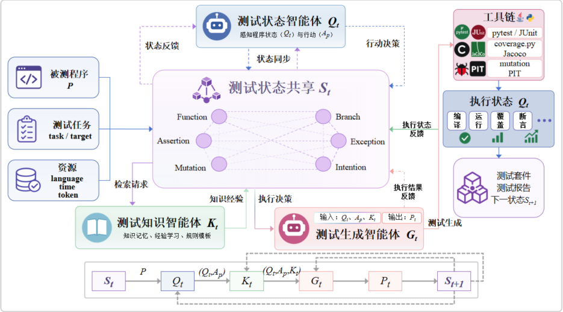
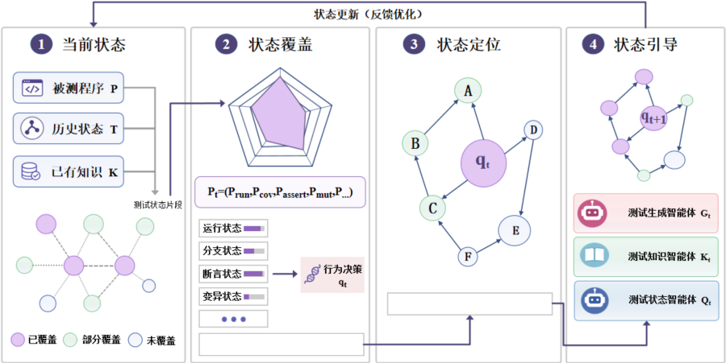
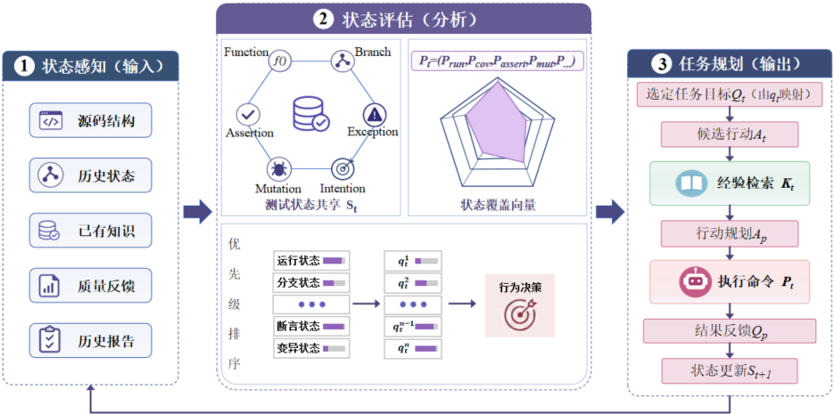
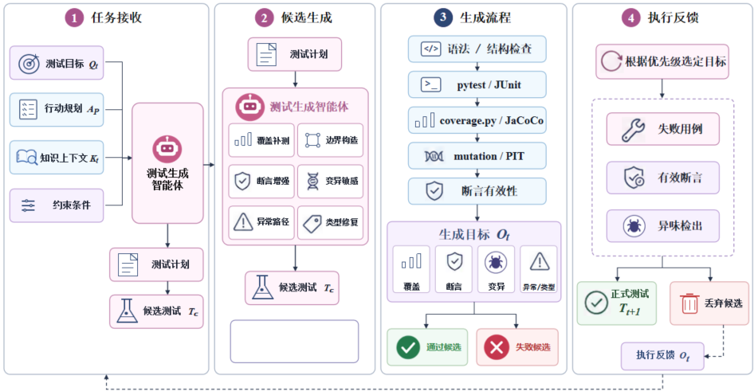
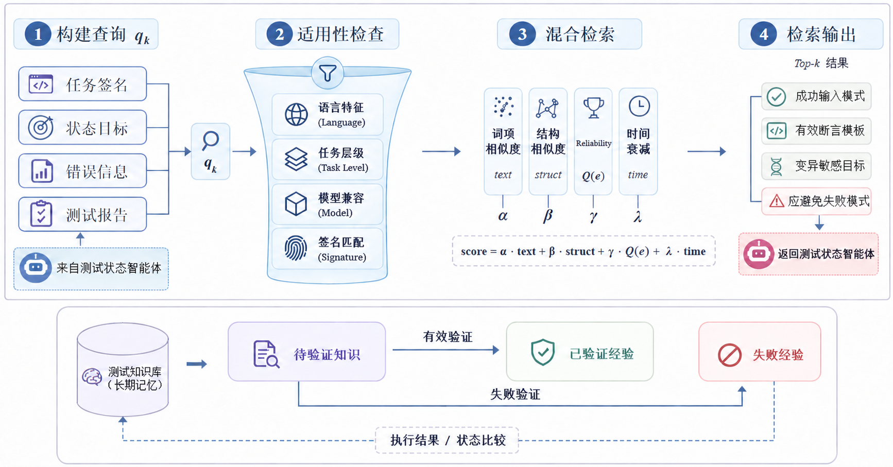

# 基于测试状态引导机制的多智能体协作测试代码智能生成方法

## 摘要

自动化单元测试生成需要持续识别测试不足，并据此选择后续目标。程序结构、测试要求与执行结果缺少统一组织时，执行反馈难以持续支持目标选择。为此，本文提出测试状态引导的多智能体协作方法TSGColAgent。该方法以共享测试状态关联测试要求和历史尝试，确定生成、修复与优化目标，再依据执行结果更新后续任务。测试状态智能体、测试生成智能体和测试知识智能体分别完成状态分析、候选生成和知识检索，支持跨轮次协作及经验复用。实验从测试充分性、测试有效性、执行有效性和生成过程四个方面进行评价。在六个主要评价对象的18组模型条件中，LC、BC、AE和MS分别在17、13、8和18组高于相应比较方法的最高值。消融结果显示，状态驱动目标选择、知识积累和共享状态协作均改善了生成结果。断言质量和复杂分支覆盖仍受到任务及模型条件影响。

关键词：单元测试生成；测试状态引导；多智能体协作；目标改善；知识复用；变异测试

## Abstract

Automated unit test generation must identify testing deficiencies and select subsequent targets. When program structure, test requirements, and execution results are not organized consistently, execution feedback provides limited support for continued target selection. This paper presents TSGColAgent, a multi-agent method based on test state guidance. A shared test state links requirements and previous attempts, guides generation, repair, and optimization targets, and incorporates execution results into subsequent tasks. The test state agent, test generation agent, and test knowledge agent perform state analysis, candidate generation, and knowledge retrieval, respectively. Task history supports collaboration across rounds, while accumulated knowledge supports experience reuse. Experiments evaluate test adequacy, test effectiveness, execution validity, and the generation process. Across three models and six primary evaluation settings, LC, BC, AE, and MS exceed the best corresponding comparison method in 17, 13, 8, and 18 settings, respectively. Ablation results show improvements from state-driven target selection, knowledge accumulation, and shared-state collaboration. Assertion quality and complex branch coverage remain affected by task and model conditions.

Keywords: unit test generation; test state guidance; multi-agent collaboration; target improvement; knowledge reuse; mutation testing

## 1 引言

单元测试对函数、类或模块等较小程序单元进行独立验证，能够在开发早期发现缺陷并降低维护成本[[1]](#ref-1)。自动化单元测试生成在不同语言和任务层级中仍面临三类问题。

一是测试目标、源码结构和执行结果相互分散。覆盖报告能够描述代码的执行范围，但覆盖与缺陷检出之间的关系还受到测试套件规模等因素影响[[2]](#ref-2)，仅凭覆盖结果难以确定后续目标。二是部分模型生成测试存在断言知识不足或预期结果推断错误，测试执行通过后，预期行为仍可能缺少具体检查[[3]](#ref-3)[[4]](#ref-4)。三是生成过程需要协调输入构造、覆盖补测、断言增强、异常路径与变异检测，目标安排和上下文利用会影响处理效果。

不同语言进一步增加了任务差异。Python中的运行时分派、鸭子类型和可变对象加大了输入构造与行为判断的难度；Java中的继承、接口多态、构建依赖和异常体系则增加了调用及对象初始化的复杂性。

已有研究从搜索式测试生成、符号执行和大语言模型辅助生成等方向提出改进方法，相关综述归纳了这些技术的演进及其在测试质量、执行效率和适用范围方面的挑战[[5]](#ref-5)。搜索式方法能够系统探索输入空间，但在复杂对象构造场景中容易受到搜索空间膨胀影响。覆盖反馈提供程序到达信息，断言质量还取决于对运行行为的具体检查。大语言模型能够生成语义上更自然的测试代码，但容易产生弱断言、不可执行依赖和路径理解偏差。多智能体方法通过分工、反思或共识提高生成稳定性。然而，若协作仅围绕文本提示和执行日志展开，各智能体仍缺少共同的结构化依据。执行反馈主要用于修改当前候选，难以持续支持不同质量目标之间的规划与协调。

为解决执行反馈分散、后续目标安排与知识利用难以衔接的问题，本文提出测试状态引导的多智能体协作方法（Test State Guided Collaborative Agents，TSGColAgent）。该方法通过测试状态引导机制（Test State Guidance，TSG），将程序结构、测试要求和执行结果组织为共享测试状态，据此选择目标、检索知识并确定生成或修复行动。

本文围绕以下四个研究问题展开。

RQ1：TSGColAgent在不同编程语言、测试任务和模型条件下的测试覆盖、测试质量与生成效果如何？

RQ2：与固定目标组织和无状态引导的配置相比，状态驱动目标选择能否提高生成测试的结构覆盖与测试质量？

RQ3：跨任务知识的持续积累与检索能否改善测试生成结果，成功经验和失败经验在复用过程中呈现何种分布？

RQ4：与无共享测试状态的多智能体对照流程相比，共享测试状态能否改善协作生成的结构覆盖与测试质量？

本文主要贡献如下。

第一，提出TSGColAgent及统一的共享测试状态表示，将程序结构、测试要求和执行反馈关联到具体程序位置，为跨语言与不同任务层级的生成提供共同依据。

第二，提出测试状态引导机制，依据未满足要求、执行依赖和历史变化组织有序目标，形成相容的生成、修复或优化任务，并通过已满足要求保护与目标词典序比较保留候选。

第三，建立由测试状态智能体、测试生成智能体和测试知识智能体构成的协作机制，通过任务历史传递跨轮次信息，通过知识积累复用成功操作与失败模式。

第四，开展跨语言、多模型的方法比较，以及固定目标组织、状态引导、知识积累和无共享状态多智能体流程的消融比较，从测试结果与处理成本分析TSGColAgent的作用。

本文其余部分安排如下：第2章介绍相关工作，第3章提出测试状态引导方法，第4章开展对比实验、消融实验与知识复用分析，第5章讨论方法局限及有效性威胁，第6章总结全文。

## 2 相关工作

自动化单元测试生成的研究既涉及测试代码的构造，也涉及测试目标的选择与测试结果的判断。不同方法使用的程序信息、反馈来源和优化对象有所差异，因而对覆盖不足、候选失败和断言薄弱等问题形成了不同的处理方式。本章围绕测试充分性与结果判定、自动化生成、大语言模型辅助生成以及多智能体协作展开讨论，重点分析与测试状态引导相关的技术机制及其适用范围。

### 2.1 单元测试评价

单元测试以函数、方法、类或模块为对象，通过输入构造、目标调用和结果检查验证程序的局部行为。Ammann和Offutt从覆盖准则与测试设计的关系出发，将程序结构和行为要求转化为可以由测试满足的具体要求[[1]](#ref-1)。对于自动化生成，输入能够触达目标位置只是其中一个环节；对象初始化、调用顺序以及调用后的观察共同决定测试是否具有实际作用。因此，测试生成既需要解决如何执行目标程序，也需要解决应观察哪些行为及如何判断结果。

结构覆盖为测试设计提供了可定位的目标。语句和分支覆盖根据执行位置识别未充分测试的代码，数据流覆盖则进一步关注变量定义与后续使用之间的联系。Neto等提出覆盖定义—使用关联的图表示，处理既有表示遗漏有效路径而影响覆盖关系分析的问题[[6]](#ref-6)。这类研究把测试充分性落实到程序中的具体关联，而不是仅给出一个汇总比例。对持续生成而言，保留未满足要求所在的位置及其上下文，有助于形成后续输入约束；但结构要求本身仍需与断言观察相结合，才能判断被执行的行为是否得到检查。

测试预言的来源决定了结果判定的含义。Barr等系统讨论了依据规格、已有程序行为及其他信息构造预言的困难[[7]](#ref-7)。根据当前实现记录输出可以形成回归断言，用于检测后续修改造成的行为变化；依据需求或规格构造断言则着重判断实现是否满足预期。两类断言分别服务于行为变化检测和需求符合性判断。在模型辅助生成中，这一区别同样影响验证方式：可执行性检查能够排除语法和调用错误，而预期值是否正确，还取决于需求信息和断言推导过程。

覆盖与测试有效性的关系进一步说明了多方面评价的必要性。Inozemtseva和Holmes在控制测试套件规模后发现，覆盖与测试有效性呈较弱至中等程度的相关关系，较强的覆盖形式也未必提供更充分的有效性信息[[2]](#ref-2)。Barani等从既有研究中梳理影响这种关系的因素[[8]](#ref-8)。生成方法的比较因而涉及覆盖范围、测试规模及结果检查方式；覆盖提升能够表明程序探索有所扩展，但对于已经被覆盖的路径，还需要考察其关键输出与状态变化是否被断言观察。

变异测试从受控程序修改出发，分析测试能否区分原程序与变异程序。Papadakis等归纳了变异算子、等价变异体、执行成本及应用方式等研究问题[[9]](#ref-9)；Just等通过经验研究分析变异体检出与实际缺陷检出之间的联系[[10]](#ref-10)。变异分析因而能够补充结构覆盖，但其结果仍与所选算子、可执行变异体及测试观察有关。对生成过程而言，存活变异体既可能关联未到达的程序位置，也可能关联已经执行但检查不足的行为，这两种情况分别要求补充输入或增强断言。

质量评价也逐渐从单一指标扩展到相互补充的测量。Jiang等面向在线评测系统，将覆盖、变异得分、测试规模和误通过率结合，并通过执行特征聚类与差分测试识别通过既有测试的错误程序[[11]](#ref-11)。这些研究表明，程序到达、行为观察与缺陷检出描述了不同的测试属性。本文把相应执行事实组织为共享状态，用于定位当前不足并选择下一测试目标。

### 2.2 传统测试生成方法

传统自动化生成方法主要依据程序分析或搜索反馈构造测试，随机测试、符号执行和搜索式生成分别采用不同方式探索输入空间。Chen等的综述将搜索式、符号执行、规格驱动及模型驱动生成纳入统一研究范围，讨论了各类方法的技术演进[[5]](#ref-5)。这些路线之间的差异不仅在于如何产生候选，还在于如何识别值得继续探索的目标，以及如何在有限预算内保留已有生成成果。

反馈引导的随机生成通过运行结果约束后续探索。Pacheco等在构造调用序列时执行候选，并利用结果区分可继续扩展的序列与无效序列[[12]](#ref-12)。相较于彼此独立的随机输入，这种方式能够复用已经形成的对象和调用前缀，使探索逐步建立在可执行片段之上。不过，序列有效并不意味着其能够到达特定深层分支，反馈筛选与目标导向生成仍有区别。对于需要满足多个条件的路径，生成过程还需要能够表达与目标的距离或约束。

搜索式测试生成将上述目标转化为适应度，通过候选选择、交叉与变异逐步改进测试。Fraser和Arcuri提出完整测试套件生成，将整个套件而非单个测试作为优化对象，同时考虑多个覆盖目标与套件规模[[13]](#ref-13)。其动机在于，覆盖目标之间存在依赖、难度差异和不可达情形，逐个独立处理目标会使结果受到目标顺序影响。以套件为对象可以保留不同测试对不同目标的贡献，但目标较多时，如何分配搜索资源仍会影响优化效率。

Panichella等进一步提出DynaMOSA，依据控制依赖层次动态选择当前待优化的目标[[14]](#ref-14)。这种选择将注意力集中到搜索进程中已经具备探索条件的覆盖要求，减少同时处理大量目标的负担。完整套件生成与动态多目标选择由此形成两种相联系的思路：前者协调候选集合对多个目标的贡献，后者根据目标之间的关系调整优化范围。这两种策略分别通过保留套件贡献和调整活动目标来分配搜索资源，执行反馈由此作用于不同层次的搜索决策。

语言特性决定了这些策略需要哪些辅助信息。Java的方法签名和类型声明为参数与对象构造提供约束，Python则可能缺少完整的参数类型，输入对象能否支持目标操作通常还需运行验证。Pynguin将自动测试生成应用于Python，提供测试构造、执行和搜索支持[[15]](#ref-15)；其经验研究进一步考察了不同生成配置在Python模块上的表现，以及类型信息等条件对生成效果的影响[[16]](#ref-16)。因此，把一种语言上的搜索策略迁移到另一种语言，还需处理输入表示、类型来源及测试执行机制的差异。

传统方法已经具备反馈利用和动态目标选择能力，因此本文的研究重点是将这些信息进一步组织为可供协作使用的测试状态。与仅围绕输入序列或覆盖目标安排搜索相比，TSGColAgent把目标位置、断言观察、异常与类型反馈共同关联到状态片段，再决定补测、修复或增强行动。测试状态在执行后继续更新，使下一项任务能够利用前一项操作形成的质量变化。

### 2.3 大语言模型测试生成方法

代码语言模型把源码、自然语言与代码生成建立了联系。Chen等对代码模型的评价采用程序执行检验生成结果，为后续研究区分文本生成质量与程序行为正确性提供了基础[[17]](#ref-17)。在单元测试任务中，模型能够从命名、注释和上下文推断候选输入与断言，但这些推断仍需经过测试工具检查。现有方法由此逐渐形成模型生成与程序分析相结合的路线，主要差异体现在模型的介入时机、提示中组织的信息及执行反馈的使用方式。

混合生成首先关注搜索停滞时如何引入新的输入。CODAMOSA监测搜索过程，在覆盖提升停滞时请求代码模型生成测试种子，再将其交回搜索继续优化[[18]](#ref-18)。这种设计让模型承担突破局部搜索范围的任务，同时保留搜索对已有候选的利用。模型生成并非替代整个搜索过程，而是由搜索进展触发的一项操作，因而候选交接与触发条件会影响有限预算内的探索效果。

pytLMtester将大语言模型与演化生成结合，针对无类型语言的输入构造困难补充模型信息[[19]](#ref-19)。模型在此承担帮助探索有效输入的作用，运行反馈仍用于判定候选的实际表现。它与完全由模型一次性生成测试的方式不同，保留了搜索过程对候选的持续选择。与CODAMOSA在搜索停滞时补充种子相比，pytLMtester着重利用模型信息支持无类型语言的输入构造，二者的模型介入条件和搜索衔接方式不同。

覆盖引导的提示方法则直接围绕未覆盖位置组织模型任务。CoverUp结合覆盖结果与代码上下文定位待补测片段；候选运行失败或未增加覆盖时，继续对话请求修改，并允许模型获得额外源码上下文[[20]](#ref-20)。CGTest先使用传统生成方法构造初始测试，再针对剩余未覆盖部分调用模型[[21]](#ref-21)。与CODAMOSA在搜索停滞时补充种子相比，这两种方法更直接地把覆盖不足转化为模型任务，CGTest还把模型调用成本纳入处理安排。CoverUp通过持续对话修改候选，CGTest则从传统方法已有的测试出发处理剩余未覆盖部分。

路径引导与覆盖引导在上下文构造上也有不同侧重。SymPrompt根据执行路径组织多阶段提示，并加入相关类型和依赖信息，使模型围绕路径条件逐步构造测试[[22]](#ref-22)。覆盖引导主要利用执行后尚未到达的位置，路径引导则进一步组织到达目标所需的条件。Agarwal等考察需求描述和被测代码等输入对测试正确性、缺陷检测及覆盖结果的影响[[23]](#ref-23)。路径条件、类型与依赖信息解决的是输入能否到达目标的问题，需求描述则约束到达后应检查的行为，二者对应不同的上下文需求。

验证与修复方法关注候选生成后如何形成可用测试。ChatUniTest组织自适应目标上下文，在生成后进行验证，并结合规则处理与模型修复纠正候选错误[[24]](#ref-24)。该方法将可由确定性规则处理的错误交由固定操作处理，其余问题则利用错误信息重新构造提示。ASTER通过静态分析准备上下文，配合输出处理、错误修复和覆盖扩展支持Java与Python，并将测试自然性纳入评价[[25]](#ref-25)。相较于只关注测试能否运行，ASTER还关注生成结果在开发实践中的可读性与可接受性，体现了测试可读性与工程可接受性之间的联系。

ValiFixTest把动态验证和最小目标修复用于迭代优化，在结构化上下文基础上调整验证范围，并通过局部修改处理生成问题[[26]](#ref-26)。LLMLOOP则围绕编译、静态分析、测试失败和变异分析组织反馈循环，改进模型生成的代码与测试[[27]](#ref-27)。二者都利用运行结果继续修改候选，但处理对象和组织粒度不同：前者着重测试验证与局部修复，后者同时覆盖生成程序和测试的改进。失败恢复着重形成可执行候选，质量增强则进一步增加对目标行为的检查，二者对应不同的反馈需求。

断言增强研究进一步关注测试中的观察内容。A3Test将断言知识迁移到测试生成，并检查测试名称与签名的一致性[[3]](#ref-3)，其改进同时涉及模型知识和生成结果验证。MUTGEN则将变异反馈加入提示，通过迭代生成处理存活和未覆盖变异体[[28]](#ref-28)。A3Test侧重提高生成断言和测试结构的可用性，MUTGEN侧重由程序行为差异驱动后续生成；这两种方向分别作用于初始候选质量与执行后的定向增强。覆盖不足与断言不足可能出现在不同程序位置，对应的输入构造与行为检查任务也需分别组织。

反馈还可以作用于模型训练，而不仅限于推理时的候选修改。RLTF将不同粒度的单元测试反馈用于强化学习，调整代码模型的生成行为[[29]](#ref-29)。与采用预训练模型并反复修改提示的方法相比，这一路线把经验吸收到模型参数中，对训练数据与训练过程有不同要求。推理阶段的反馈方法将结果保留于任务上下文或外部记忆，训练阶段的方法则通过参数更新吸收反馈，二者在经验存储位置和更新成本上有所区别。

检索增强为上下文不足提供了另一种处理方式。Lewis等将参数化模型与外部检索结合，用于知识密集型生成[[30]](#ref-30)。RepoCoder把相似内容检索和代码补全组织成迭代过程，使生成结果参与后续检索，逐步利用仓库中的跨文件信息[[31]](#ref-31)。MultiMend则在程序修复中检索相关源码行以补充故障上下文，并组织多位置补丁[[32]](#ref-32)。这些方法面向不同生成任务，均通过相关性选择组织当前目标所需的信息。

对于持续测试生成，源码上下文与历史测试经验具有不同用途：源码提供当前项目的接口和依赖，历史经验提供曾经有效的输入、断言及应避免的失败模式。TSGColAgent由测试状态智能体根据当前目标组织知识请求，再将检索结果打包为生成上下文。本文关注这些经验如何随目标变化进入下一项任务，以及生成结果如何反过来更新可复用经验，具体机制在3.3节给出。

### 2.4 多智能体测试生成方法

多智能体测试生成把复杂任务分配给不同角色，使计划构造、候选生成和结果评估能够由不同角色分别承担。与同一模型在固定提示下反复修改相比，角色分工可以明确每次交接需要完成的工作，协作效果取决于各角色使用的目标是否一致、执行反馈如何传递，以及何种结果会触发重新规划。现有研究围绕共识、计划表达、对抗交互与仓库级上下文形成了不同的协作安排。

CANDOR区分测试前缀生成与预言修正，通过专用角色完成初始化、规划、测试生成和检查，并利用多个推理模型的讨论形成预言判断[[4]](#ref-4)。这种安排把测试能够执行与预期结果是否合理分别处理，针对的是端到端JUnit生成中的候选质量与幻觉问题。其协作重点在于角色分工和预言共识，说明反馈既可以来自测试工具，也可以来自对需求与观察结果的不同分析；两类反馈在使用时仍需明确各自所回答的问题。

QAagent在生成测试前，先以自然语言伪代码形成函数实现计划，再依据该计划构造基本情形与边界情形的测试[[33]](#ref-33)。相较于直接将全部分析和生成要求置于一次提示中，这种方式为角色交接提供了显式计划。计划表达侧重在生成前分解行为要求，而运行状态还需要随着测试执行更新；对于反复修复或增强的任务，原有计划与最新执行结果之间的衔接因此成为进一步需要处理的问题。

UAgent围绕定向缺陷揭示研究对抗协同演化，把测试生成与攻击性挑战置于相互作用的过程中[[34]](#ref-34)。其组织目标与基于共识的方案有所区别：共识着重协调不同判断，对抗则通过暴露已有测试的不足推动改进。两者通过不同的中间结果、成功条件和停止条件组织多角色协作。

仓库级测试还涉及方法之外的类、依赖和调用信息。TestAgent以代码知识组织仓库中的实体与关联，通过规划、生成和评审角色结合工具执行反馈完成迭代测试[[35]](#ref-35)。相较于只围绕独立函数进行交接，这种方式把跨文件上下文纳入协作，体现了结构化程序信息对任务规划的作用。结构化上下文为仓库级调用和依赖分析提供了共同基础，动态反馈则使既有计划能够随执行结果调整。

Lu等提出的Procedural Graph框架根据执行进展定位局部上下文，为下一步行动形成引导，并保留未接受的修改以支持后续改进[[36]](#ref-36)。该工作把过程知识组织为可编辑的执行结构，其对象与本文的测试状态不同；本文将程序结构、测试要求、执行反馈和历史变化用于测试目标规划，历史候选保存用于质量比较及经验复用。两者在利用当前进展和成功、失败历史方面具有相近思路。

上述研究使角色分工与程序分析逐步结合，但它们对共同工作内容的组织各有侧重。CANDOR围绕测试前缀及预言正确性协调角色，QAagent利用自然语言计划承接生成，UAgent以对抗交互推动测试演化，TestAgent利用仓库知识支持规划、生成与评审[[4]](#ref-4)[[33]](#ref-33)[[34]](#ref-34)[[35]](#ref-35)。这些协作安排分别依赖预言判断、自然语言计划、对抗结果或仓库上下文，反馈对象与任务交接粒度也各不相同。

TSGColAgent以共享测试状态承接上述信息，测试状态智能体负责分析当前不足并组织目标与知识请求，测试知识智能体提供适用经验，测试生成智能体根据任务目标和相关上下文生成候选，并返回执行结果。状态发生变化时，由新的规划任务重新组织所需上下文，生成智能体不主动发起检索。这种职责安排将检索时机与目标选择联系起来，也使测试修改始终具有对应的状态目标。状态引导、知识复用及整体协作流程分别在实验中进行分析。

### 2.5 本章小结

本章围绕测试充分性与结果判定、传统自动化测试生成、大语言模型辅助生成以及多智能体协作等研究方向进行了梳理。现有方法分别在覆盖引导、执行反馈、测试修复、知识检索和多角色协作等方面取得了进展，但这些信息在持续测试生成过程中仍缺少统一组织与协同利用。

基于此，本文构建共享测试状态统一表示程序结构、测试要求、执行结果和历史信息，在此基础上通过测试状态引导机制完成不足识别、目标选择与候选评价，并结合测试状态智能体、测试生成智能体和测试知识智能体实现测试生成、修复、知识检索与经验复用。第3章将进一步介绍上述方法的具体设计。

## 3 方法概述

### 3.1 TSGColAgent总体框架

TSGColAgent以被测程序$P$、已有测试$T_0$、测试要求、跨任务知识库$KB$和执行配置为输入，目标是在测试过程中持续识别尚未满足的要求，生成可执行且能够检查目标行为的测试，并利用已有尝试改进后续结果。

方法由测试状态智能体、测试生成智能体和测试知识智能体组成。测试状态智能体负责构建和更新测试状态，确定当前目标与行动；测试生成智能体按照任务要求生成、修复或优化候选测试；测试知识智能体提供与当前任务相关的经验，并在任务结束后更新跨任务知识。

方法首先初始化程序与已有测试信息，构建共享测试状态，再从状态中识别当前不足并选择测试目标。需要经验支持时，由测试状态智能体发起知识请求，并将检索结果与任务上下文一并交给测试生成智能体。候选经工具执行后，由测试状态智能体评价并确定保留结果，更新共享状态和任务历史，进入下一轮规划。总体流程如图1所示。



图1 TSGColAgent总体框架图

TSGColAgent的核心是将程序结构、测试要求和执行结果组织为共享测试状态，并依据状态变化确定后续测试目标。三个智能体围绕共享状态完成规划、生成与知识复用，以下分别介绍测试状态引导机制和多智能体协作过程。

### 3.2 测试状态引导机制

#### 3.2.1 测试状态引导建模

共享测试状态定义为式（1）。

$$
S_t=\langle V_t,E_t,X_t,M_t\rangle\tag{1}
$$

式中，$V_t$包含程序结构节点和测试执行节点，$E_t$表示结构关系及运行关系。$X_t$记录节点、关系的属性，并包含要求属性表$X_t^{\mathrm{req}}$，按要求标识保存满足状态及对应位置的局部结果。$M_t$保存当前任务、目标、状态版本、历史引用与摘要、测试要求集合及映射$\mu_t$。映射$\mu_t$将每项要求的稳定标识关联到$V_t$中的节点和$E_t$中的关系。

每个任务最多经历3个正式候选轮次$r\in\{1,2,3\}$，每轮对应一次生成、修复或优化尝试。$t$表示轮内状态更新步，完整状态记为$S_t^{(r)}$。分析、知识检索和工具评价可以产生多个状态版本，与候选轮次分别计数。同一轮内省略上标$r$，用$S_t$与$S_{t+1}$表示行动前后的状态，中间采集结果通过状态版本关联。下一轮以此前保留测试和累计任务历史初始化。

共享测试状态包含四类节点。程序实体节点描述函数、方法、类及其接口，确定测试对象与调用边界；控制结构节点描述分支、循环及控制转移，定位到达目标所需的路径条件；行为节点描述返回、调用与异常，确定需要观察的结果；测试执行节点记录测试用例、断言、变异体及运行类型。结构关系连接程序依赖。执行（Execute）、行为观察（Observe）、变异检出与存活（Kill/Survive）以及类型流转（TypeFlow）等运行关系，则将测试操作关联到相应程序行为。通过这些关系，覆盖不足、行为检查不足、存活变异体和执行阻塞能够定位到具体程序位置，为后续目标构造提供状态依据。

初始状态由源码分析和测试上下文分析共同建立。语言解析器提供AST、接口、控制结构和调用关系；已有测试提供目标调用、输入、断言及历史执行信息。后续工具反馈更新对应位置的访问和行为状态。

测试要求在任务初始化阶段形成，如式（2）所示。

$$
\mathcal R(P)=\mathcal R_{\mathrm{base}}(P)\cup\mathcal R_{\mathrm{task}}(P),
\qquad \mathcal R_{\mathrm{req}}\subseteq\mathcal R(P).\tag{2}
$$

式中，基本要求$\mathcal R_{\mathrm{base}}$来自测试任务的共同执行条件，包括目标接口可调用、测试可收集和执行，以及适用的正常行为观察。明确要求的异常行为、输入约束与变异目标根据任务适用性建立。$\mathcal R_{\mathrm{task}}$来自数据集给出的目标、基准任务指定的位置及实验配置启用的程序覆盖和行为要求。每项要求保存来源、稳定标识、对应位置和适用条件。必需要求$\mathcal R_{\mathrm{req}}$与可选优化要求在初始化时区分。

要求集合通过$M_t$中的$\mu_t$关联到状态结构，其满足情况读取$X_t^{\mathrm{req}}$，即$\operatorname{Status}(u,S_t)=X_t^{\mathrm{req}}[\operatorname{id}(u)].\operatorname{status}$。涉及多个程序位置的要求通过$\mu_t$汇聚局部结果，更新同一标识下的要求状态。

测试要求分为已满足（Satisfied）、未满足（Unsatisfied）、未知（Unknown）和不适用（N/A）四种状态。前两种由执行结果判定，信息采集不完整或工具异常时保留未知状态，合法不适用的要求则单独标识。必要要求从初始化时确认适用的要求中确定，未知要求保留在待确认范围内。已知尚未建立测试的目标接口归为未满足要求，其来源和范围由任务及分析配置确定。

当前任务历史$H_t$保存各轮候选、执行结果、错误类型、目标变化、已尝试操作、知识使用及候选保留情况。$KB$存储已结束任务的可复用经验，当前任务使用固定只读快照；任务完全结束后，从完整历史提取经验证的经验并提交，供后续任务检索。

测试状态片段以一个或一组关联要求为中心，包含程序位置、测试位置、输入条件、执行依赖和允许修改范围，为目标定位及任务合并提供依据。

待处理项包括未满足要求、执行阻塞以及当前工具能够确认的未知状态，如式（3）所示。

$$
\begin{aligned}
\mathcal I_t^{\mathrm{unknown}}&=
\{u\in\mathcal R(P)\mid \operatorname{Status}(u,S_t)=\mathrm{Unknown}
\land\operatorname{Confirmable}(u,S_t)\},\\
\mathcal I_t&=
\{u\in\mathcal R(P)\mid\operatorname{Status}(u,S_t)=\mathrm{Unsatisfied}\}
\cup\mathcal I_t^{\mathrm{block}}\cup\mathcal I_t^{\mathrm{unknown}}.
\end{aligned}\tag{3}
$$

式中，$\mathcal I_t^{\mathrm{block}}$记录语法、导入、编译、依赖、测试收集及目标调用等阻塞。当观测工具可用、必要输入和执行环境就绪，且同一测试版本与工具配置下尚未尝试确认时，Confirmable成立。通过工具观测确认未知要求，并将结果记入任务历史；确认未满足后，再确定相应的生成或修复目标。当前无法观测或确认失败的状态保留原因，测试版本或工具条件发生变化后可重新确认。

程序结构与运行信息进一步将测试不足关联到具体程序位置，并据此形成可执行的测试目标。例如，未覆盖分支对应相应的输入构造目标；已执行但缺少有效观察的返回行为对应断言增强目标；存活变异体对应变异检测目标；尚未验证的异常行为对应异常测试目标。由此，共享测试状态能够将覆盖、行为观察和变异检测等结果转化为后续测试生成与优化所需的具体任务。

#### 3.2.2 测试状态引导算法

TSG优先处理执行阻塞。对于其他不足，优先选择前置条件已经满足的目标，再考虑与最近状态变化相关的持续不足。同一优先层内按源码路径、限定名、位置和目标标识稳定排序。映射到同一程序片段、输入相容且修改范围可共同处理的目标可以合并，合并后仍保持原子目标的优先次序。每轮最多处理3个原子目标，按上述次序选择，剩余目标在后续状态分析中继续考虑。该过程形成有序目标集合$Q_t=(q_1,\ldots,q_m)$，顺序同时用于候选比较。

持续不足是指同一要求标识在最近两个可比较状态中均为未满足。若其位置位于最近修改范围内，或通过调用、控制及数据依赖与该范围关联，则标记为与最近变化相关。排序使用这些可检查的关系；任务历史同时提供已经尝试的输入和修改，供下一行动选择。

目标合并需要共享被测调用或测试片段，输入的类型、取值区间和相等约束一致或具有非空交集。允许修改范围不重叠，或重叠位置要求相同替换时，目标可以共同处理；约束矛盾或无法确认相容时分别生成任务包。有效优化目标是初始化配置启用、尚未满足且前置条件已具备的可选要求。修改范围以相对于当前保留测试发生变化的AST语句数比较，增加、删除和替换的语句均计入。

目标类型决定生成、修复或优化行动，目标位置及依赖关系确定允许修改范围。测试状态智能体将有序目标、已满足要求保护条件和任务历史摘要封装为任务包；当任务历史不能提供所需经验时，提出知识请求，具体检索过程见3.3.3节。测试状态引导过程如图2和算法1所示。



图2 测试状态引导算法流程示例图

**算法1 测试状态引导算法**

```pseudocode
Input: P, S_t, H_t, KB_read, R, config
Output: S_t, H_t, Q_t, A_t, K_t

01: S_t ← CompleteState(P, CurrentTests(S_t), S_t, H_t)
02: I_t ← UnsatisfiedRequirements(R, S_t) ∪ ObservedExecutionBlocks(S_t)
          ∪ ConfirmableUnknowns(R, S_t, H_t)
03: (S_t, H_t) ← RecordPendingItems(S_t, H_t, I_t)
04: if ResourceLimitReached(config) then return (S_t, H_t, ∅, Stop, ∅)
05: for each u ∈ StableOrderedConfirmableUnknowns(R, S_t, H_t) do
06:     if ResourceLimitReached(config) then break
07:     result ← ConfirmWithTool(u, CurrentTests(S_t), config)
08:     (S_t, H_t) ← UpdateStateAndRecordConfirmation(S_t, H_t, u, result)
09: end for
10: I_unknown ← ConfirmableUnknowns(R, S_t, H_t)
11: I_t ← UnsatisfiedRequirements(R, S_t) ∪ ObservedExecutionBlocks(S_t) ∪ I_unknown
12: (S_t, H_t) ← RecordPendingItems(S_t, H_t, I_t)
13: if ResourceLimitReached(config) then return (S_t, H_t, ∅, Stop, ∅)
14: targets ← ResolveActionablePrerequisites(I_t ∖ I_unknown, R, S_t)
15: targets ← StableOrder(targets, path, qualified_name, position, target_id)
16: targets ← OrderByBlocksReadyPrerequisitesAndRecentPersistentChange(targets, H_t)
17: groups ← MergeCompatibleInputsAndNonconflictingScopes(targets)
18: Q_t ← TakeAtomicTargetsWithinCapacity(groups, config.target_capacity)
19: if QualitySatisfied(S_t, R) and NoEnabledOptimization(targets, config) then
20:     return (S_t, H_t, ∅, Stop, ∅)
21: end if
22: if NoActionableTarget(Q_t) then return (S_t, H_t, ∅, Stop, ∅)
23: A_t ← MapTargetsToGenerationRecoveryOrImprovement(Q_t)
24: A_t.scope, A_t.protected ← DetermineScopeAndSatisfiedRequirements(S_t, Q_t)
25: A_t.context ← RelevantTaskHistory(H_t, Q_t)
26: K_t ← ∅
27: if MissingReusableKnowledge(Q_t, A_t.context) then
28:     query ← BuildQuery(S_t, H_t, Q_t, A_t)
29:     K_t ← RetrieveByKnowledgeAgent(query, S_t, KB_read, config)
30: end if
31: return (S_t, H_t, Q_t, A_t, K_t)
```

算法1将状态确认、不足识别和目标选择衔接起来，再为选定目标检索经验并确定行动范围。同一测试版本与工具配置下，每个未知项至多确认一次；确认前后均按式（3）保存待处理集合。资源限制导致提前结束时，尚可确认的未知项仍保留在共享状态与任务历史中。候选生成后，依据执行结果、已有要求及目标变化继续评价。

候选基本执行条件按式（4）判断。

$$
\operatorname{Executable}(T)=
\operatorname{Collected}(T)\land\neg\operatorname{Timeout}(T)\land\operatorname{Pass}(T).\tag{4}
$$

Collected表示框架实际收集到测试，Timeout表示测试执行超时，Pass表示测试在当前被测版本和任务执行语境下完成并通过判定。覆盖工具的有效性决定LC、BC是否可测，断言观察情况更新对应行为要求。能够执行而缺少有效断言的测试可以作为状态输入，后续由TSG安排观察目标。

候选接受同时保护已经建立的测试要求。设$\mathcal W_t$为任务包明确允许替换的要求，保护集合及条件见式（5）。

$$
\begin{aligned}
\mathcal P_t&=\{u\in\mathcal R(P)\mid
\operatorname{Status}(u,S_t)=\mathrm{Satisfied},\ u\notin\mathcal W_t\},\\
\operatorname{Protect}(S_t,S_{\mathrm{cand}})
&=\bigwedge_{u\in\mathcal P_t}
[\operatorname{Status}(u,S_{\mathrm{cand}})=\mathrm{Satisfied}].
\end{aligned}\tag{5}
$$

$\mathcal W_t$由测试状态智能体根据任务允许的替换范围给出，限于任务事先许可替换的非必要要求，必要行为的检验要求保持有效。保护检查对应已覆盖位置、已有行为观察、已验证异常及可比较的变异体检出等事实。相同要求使用一致标识与可比较执行条件验证；保护要求的状态未知时，候选保持待验证，确认之前保留当前测试结果。保护集合为空时该约束自然成立。Protect仅作为候选接受条件使用。

每轮保留决策考虑当前测试、本轮候选及仍适用的历史候选。设候选集合为$\mathcal U_r$，满足执行和保护条件的集合为$\mathcal F_r$，选择过程见式（6）。

$$
\begin{aligned}
\mathcal U_r&=\{T_{\mathrm{keep}}^{(r-1)},T_{\mathrm{cand}}^{(r)}\}
\cup\mathcal C_{\mathrm{hist}}^{(r)},\\
\mathcal F_r&=\{T\in\mathcal U_r\mid
\operatorname{Executable}(T)\land
\operatorname{Protect}(S_{\mathrm{keep}},S_T)\},\\
T_{\mathrm{keep}}^{(r)}
&=\begin{cases}
\operatorname{Select}(\mathcal F_r,Q_t),&\mathcal F_r\ne\varnothing,\\
T_{\mathrm{keep}}^{(r-1)},&\mathcal F_r=\varnothing.
\end{cases}
\end{aligned}\tag{6}
$$

$S_{\mathrm{keep}}$为本次行动开始时保留测试对应的状态，$S_T$为拟比较测试$T$对应的已评价状态，二者使用相同程序版本、要求标识与工具范围。对有序目标$q_1,\ldots,q_m$，以$z_j(T)=\mathbf 1\{\operatorname{Improved}(q_j,S_t,S_T)\}$记录该目标相对本次行动开始状态是否改善或满足，构成布尔向量$\mathbf z(T)=(z_1(T),\ldots,z_m(T))$。Select先按目标优先序比较该向量，首个不同位置的值决定次序。该向量仅表达当前目标的状态判定。

Improved由目标对应的状态变化确定：执行恢复目标对应已登记阻塞解除，覆盖目标对应指定位置或分支首次被访问，断言目标对应指定行为新增有效观察，变异目标对应指定存活变异体被杀死，异常与类型目标对应已指定行为或约束得到验证。每个原子目标保存其所需的前后状态字段，已满足状态保持不变时记为未新增改善。比较前，在通过基本执行与保护条件的候选集合内检查各目标的可比性。若某目标在任一参与比较的候选中为未知，或其程序版本、工具条件不一致，则该目标对所有候选统一不参与本轮排序。其余目标保持原优先序，各候选仅在这一共同目标集合上计算改善向量并进行词典序比较。

目标向量相同时，覆盖、断言、变异、异常和类型目标均维持该层并列，依次比较修改语句数与同类工具执行开销，最终优先保留当前测试。Observe等目标事实决定断言行动是否有效，AE留作实验分析。历史候选按当前要求与工具条件确认适用性，全部尝试及未接受结果持续保存于$H_t$。

可行候选集合为空时，保留测试版本保持不变，失败候选及其局部修复结果继续留在任务历史中。后续任务包可引用其中已经完成的修改作为修复上下文，再形成下一轮候选。若当前保留测试本身仍无法执行，任务以未满足执行要求的状态继续处理，直至得到可行候选或触发终止条件。

候选选择完成后，正式测试状态取自保留测试的已评价结果，其他候选的执行信息保存于任务历史。状态更新及智能体交接过程见3.3节。必要要求的满足判定见式（7）。

$$
\operatorname{QualitySatisfied}(S_t,\mathcal R)=
\bigwedge_{u\in\mathcal R_{\mathrm{req}}}
[\operatorname{Status}(u,S_t)=\mathrm{Satisfied}].\tag{7}
$$

必要要求全部满足且没有启用的可处理优化目标时结束任务。可确认的未知先经过工具确认；其余必要要求因缺少工具或环境而无法处理时，以对应原因结束。达到3个正式候选轮次或触发执行配置限制也会终止。候选未被接受时保留反馈，尚有轮次且执行条件允许时继续规划。

任务输出同时保留最终测试、尚未满足或待确认的必要要求以及终止原因。因此，执行限制或轮次上限触发时，已取得的测试结果与尚未完成的目标均可明确定位；执行是否通过由最终测试的框架结果判断，必要要求是否完成由式（7）判断。

### 3.3 多智能体协作测试生成

三个智能体以共享测试状态$S_t$、任务历史$H_t$和知识上下文$K_t$作为交接媒介。测试状态智能体调用TSG确定任务，测试生成智能体提交候选及工具结果，测试知识智能体按请求提供经验。各次尝试保存在当前任务历史中，跨任务知识在任务结束后更新，协作过程如算法2所示。

**算法2 多智能体协作测试生成算法**

```pseudocode
Input: P, T_0, R, KB, config
Output: T_out, H_out, KB

01: H_t ← InitializeTaskHistory()
02: S ← InitializeState(P, T_0, R)
03: T_keep ← T_0
04: KB_read ← ReadOnlySnapshot(KB)
05: for r ← 1 to 3 do
06:     S_t ← StartRound(S, r)
07:     (S_t, H_t, Q_t, A_t, K_t) ← StateGuidance(P, S_t, H_t, KB_read, R, config)
08:     if StopRequested(A_t) then S ← S_t; break
09:     T_cand ← GenerateRepairOrOptimize(P, T_keep, Q_t, A_t, K_t)
10:     O_screen ← CheckSyntaxBuildCollectionAndScope(P, T_cand, A_t.scope)
11:     if Runnable(O_screen) and not ResourceLimitReached(config) then
12:         O_t ← ExecuteAndCollectApplicableResults(P, T_cand, O_screen)
13:     else
14:         O_t ← RecordExecutionBlockOrInterruption(O_screen)
15:     end if
16:     S_cand ← BuildCandidateState(S_t, T_cand, O_t)
17:     protected ← CheckSatisfiedRequirementProtection(S_t, S_cand, A_t.protected)
18:     target_result ← EvaluateOrderedTargets(Q_t, S_t, S_cand)
19:     H_next ← ArchiveAttempt(H_t, r, Q_t, A_t, T_cand, S_t, S_cand,
                               protected, target_result, O_t)
20:     (T_keep, S_keep) ← SelectByExecutionProtectionAndOrderedTargets(T_keep, T_cand, H_next, Q_t)
21:     S_next ← UpdateWithHistoryReferences(S_keep, H_next)
22:     H_next ← AppendStateChangeAndKnowledgeUse(H_next, Compare(S_t, S_next))
23:     (S, H_t) ← (S_next, H_next)
24: end for
25: H_out ← CloseTaskHistory(H_t, S, T_keep)
26: validation ← UpdateKnowledgeValidation(UsedRecords(H_out), H_out, KB_read)
27: records ← ExtractTaskExperience(H_out)
28: KB ← CommitTaskKnowledge(KB, records, validation)
29: return (T_keep, H_out, KB)
```

算法2通过测试目标、候选结果与保留状态衔接三个智能体。每轮候选的预检查和执行采用同一测试版本，正式状态由保留测试的评价结果更新，全部尝试保存在任务历史中。任务结束后，测试知识智能体更新已使用条目的验证结果，并提交新经验。

#### 3.3.1 测试状态智能体

测试状态智能体接收源码分析、当前测试和工具反馈，构建或更新$S_t$，并调用TSG得到目标集合$Q_t$与行动$A_t$。它将目标、修改范围、保护条件和所需知识封装为任务包，交给测试生成智能体，协作过程如图3所示。



图3 测试状态智能体流程示意图

候选执行后，状态智能体形成$S_{\mathrm{cand}}=\operatorname{BuildCandidateState}(S_t,T_{\mathrm{cand}},O_t)$，评价执行条件、已有要求保护及目标改善，确定$(T_{\mathrm{keep}},S_{\mathrm{keep}})$。其中$S_{\mathrm{keep}}$必须对应实际保留测试的同版本评价结果，候选被拒绝时继续采用此前保留测试的状态。

随后通过$S_{t+1}=\operatorname{UpdateWithHistoryReferences}(S_{\mathrm{keep}},H_{\mathrm{next}})$更新正式状态的历史引用，得到$\Delta S_t=\operatorname{Compare}(S_t,S_{t+1})$。被拒绝候选的$O_t$保存在$H_{\mathrm{next}}$中，供分析失败原因和既往尝试使用；正式要求的满足状态取自$S_{\mathrm{keep}}$。状态智能体据此构造下一项任务或结束当前测试任务。

#### 3.3.2 测试生成智能体

测试生成智能体接收目标集合$Q_t$、行动$A_t$、允许修改范围、已满足要求保护条件、任务历史摘要及知识上下文$K_t$。这些信息共同规定候选应处理的目标、能够修改的位置和需要保持的测试行为，知识请求由测试状态智能体统一提出。

大语言模型依据初始化目标和当前任务包生成测试，候选构造包括输入准备、目标调用与断言检查。Python任务形成pytest测试，处理动态输入和运行时类型；Java任务结合类结构、构造器、方法签名与依赖形成JUnit测试。针对变异、异常和类型目标，结合相应输入及行为检查生成测试代码。

测试生成智能体完成候选及语法、编译、收集和执行检查后，将候选与结果返回测试状态智能体。测试状态智能体依据更新后的共享状态确定后续任务：编译或收集失败对应修复，可运行但目标未改善对应优化，行为观察不足对应断言增强。产生目标改善的候选也由测试状态智能体评价是否保留。测试生成智能体只执行收到的任务包，过程如图4所示。



图4 测试生成智能体流程示意图

#### 3.3.3 测试知识智能体

测试知识智能体维护成功经验、失败经验和待验证（Pending）条目。成功经验描述能够实现测试目标的操作，失败经验描述无效操作及其发生条件，待验证条目在后续任务中接受验证。任务历史$H_t$保存当前任务的候选与局部尝试，跨任务知识库$KB$保存已结束任务形成的经验，知识处理过程如图5所示。



图5 测试知识智能体流程示意图

知识条目的验证状态与检索相关性分别建模。已验证经验作为可采用示例，失败经验作为规避信息，待验证知识保留其验证标识。当前任务的已验证候选、失败记录及其他历史信息由$H_t$直接提供，跨任务条目由$KB$检索。记录存储按条目标识去重，检索根据任务特征和相关性筛选；同项目及同函数的历史经验按照其适用条件参与检索，经验来源与任务相似性在第5章讨论。检索增强及仓库级检索研究为相关上下文组织提供了基础[[30]](#ref-30)[[31]](#ref-31)。

具有完整结构签名的知识条目按式（8）评分，缺少结构签名的条目按式（9）评分。

$$
R_{\mathrm{exp}}=
\alpha\operatorname{Sim}_{\mathrm{text}}+
\beta\operatorname{Sim}_{\mathrm{str}}+
\gamma Q(e)+\lambda D(e).\tag{8}
$$

$$
R_{\mathrm{know}}=
\alpha'\operatorname{Sim}_{\mathrm{text}}+
\gamma'Q(e)+\lambda'D(e).\tag{9}
$$

式中，文本相似度使用规范化词项的Jaccard系数，结构相似度比较接口、控制结构、输入类型及语言特征。$Q(e)$为验证可靠度，依据支持与冲突验证次数取$(n_s+1)/(n_s+n_c+2)$，$D(e)$为时效权重。语言特征参与匹配，适用的通用经验可以跨语言使用。上述分数仅用于知识检索排序。

式（8）和式（9）的权重分别为$(\alpha,\beta,\gamma,\lambda)=(0.35,0.35,0.20,0.10)$和$(\alpha',\gamma',\lambda')=(0.55,0.15,0.30)$，各组权重之和为1，各分量取值为$[0,1]$。时效项取$D(e)=\exp(-a_e/90)$，$a_e$表示条目生成至检索时的非负天数。

两类条目分别在$R_{\mathrm{exp}}\geq\tau_{\mathrm{exp}}$和$R_{\mathrm{know}}\geq\tau_{\mathrm{know}}$时进入排序，独立设置$\tau_{\mathrm{exp}}=0.20$、$\tau_{\mathrm{know}}=0.20$，最多返回$k=5$个条目。评分仅决定各组内部次序，条目标识用于处理并列。

条目按结构签名完整或缺省，以及成功、失败、待验证状态分组。各组按分数降序排列，按成功、失败、待验证的顺序轮流选取，每类中完整签名组先于缺省组。每轮从各非空组取出首项，直至达到$k$或条目耗尽。算法3给出了分组检索过程。

**算法3 测试知识混合检索算法**

```pseudocode
Input: query, S_t, KB_read, k, tau_exp, tau_know, config
Output: K_t

01: terms, signature ← Normalize(query, S_t)
02: records ← ApplicableRecords(KB_read, query)
03: for each e ∈ records do
04:     text ← Jaccard(terms, Terms(e))
05:     reliability ← ValidationReliability(e)
06:     recency ← TimeWeight(e.age, config)
07:     if HasStructuralSignature(e) then
08:         score(e) ← ExperienceRank(text, StructuralSimilarity(signature,e), reliability, recency)
09:     else
10:         score(e) ← KnowledgeRank(text, reliability, recency)
11:     end if
12: end for
13: records ← FilterByScoreFamilyThreshold(records, tau_exp, tau_know)
14: groups ← PartitionBySignatureAndValidationState(records, Success, Failure, Pending)
15: groups ← SortWithinGroupsByScoreAndStableId(groups)
16: selected ← RoundRobinByFixedGroupOrder(groups, k)
17: return PackageExamplesAvoidanceAndPending(selected)
```

算法3通过适用性筛选和分组排序，为当前目标选择成功示例与失败规避信息。适用性由条目规定的语言、框架、输入类型和任务层级确定。任务结束后，依据完整历史记录目标类型及其变化、测试结果、执行恢复情况、错误类型、执行次数与耗时，形成后续任务可用的经验。

知识条目包含适用条件、建议操作和预期结果。任务结束后，根据实际采用的条目与任务结果更新验证次数。成功经验中的操作实现了对应目标，或失败经验所述条件下重现了指定失败时，支持次数$n_s$增加1；得到与条目预期相矛盾的可比较结果时，冲突次数$n_c$增加1。仅检索未采用、工具异常及无法区分多个条目作用的结果保持计数不变。同一条目在同一任务中最多计一次；结果混杂时标记待验证。

阶段转换采用连续两个已完成任务的验证结果。两个相邻完成且任务标识不同的任务均实际采用同一版本条目，且均实现对应目标时，待验证条目转为成功经验；均复现指定失败时，转为失败经验。中间任务未采用该条目、结果不可判定或两次结果不同，均中断该连续序列；新的可判定结果重新开始计数。累计支持与冲突次数用于可靠度，连续序列仅用于阶段转换。已确认条目出现相反结果时转回待验证，条目预期改变时建立新版本并重新计数。所有变化在任务结束时提交。

知识智能体依据请求筛选经验，不直接决定测试行动。测试状态智能体结合当前目标提出知识请求，检索结果作为任务上下文交给测试生成智能体，从而将知识使用与测试状态引导衔接起来。

### 3.4 本章小结

TSGColAgent以共享测试状态关联程序结构、测试要求及执行结果，通过TSG完成不足识别、目标选择、行动构造和候选评价。三个智能体围绕任务包协作，正式状态对应实际保留测试，任务历史保留全部尝试，跨任务知识通过验证与提交逐步积累。

## 4 实验研究

### 4.1 实验设置

为评价TSGColAgent在不同语言、任务层级和模型条件下的测试生成能力，本文开展方法对比、核心机制消融和知识复用分析。方法对比考察测试结果与生成过程，消融实验分析状态引导目标选择和知识积累的作用，知识分析考察成功经验与失败模式的使用情况。

实验覆盖Python与Java，选取TestEval[[37]](#ref-37)、HumanEval[[17]](#ref-17)、HumanEval-X[[38]](#ref-38)以及Defects4J[[39]](#ref-39)中的Commons-Cli、Commons-Csv、Commons-Lang和Gson，基本信息见表1。HumanEval与HumanEval-X分别用于考察Python和Java函数级任务，四个Java项目进一步考察对象构造、复杂依赖及项目环境下的测试生成。TestEval用于方法开发阶段的补充评价，其结果单独呈现，不纳入主要比较结论。表中的任务层级描述各数据集对应的测试对象范围。

表1 数据集介绍

<table>
<thead><tr><th colspan="2">Dataset Project</th><th>Dataset Scale</th><th>Task Level</th><th>Release / Version</th><th>Language</th><th>Domain</th></tr></thead>
<tbody>
<tr><td colspan="2">TestEval</td><td>210 programs</td><td>File/Function/Class</td><td>2025</td><td>Python</td><td>Online programming / LeetCode</td></tr>
<tr><td colspan="2">HumanEval</td><td>164 tasks</td><td>Function</td><td>2021</td><td>Python</td><td>Programming problems / Code generation</td></tr>
<tr><td colspan="2">HumanEval-X</td><td>164 tasks</td><td>Function</td><td>2023</td><td>Java</td><td>Java programming problems / Code generation</td></tr>
<tr><td rowspan="4">Defects4J</td><td>Commons-Cli</td><td rowspan="4">4 projects</td><td rowspan="4">Class/Project</td><td>1.6.0</td><td>Java</td><td>Command line interface parser</td></tr>
<tr><td>Commons-Csv</td><td>1.10.0</td><td>Java</td><td>Library for processing CSV files</td></tr>
<tr><td>Commons-Lang</td><td>3.1.0</td><td>Java</td><td>Java utility library</td></tr>
<tr><td>Gson</td><td>2.10.1</td><td>Java</td><td>JSON serialization/deserialization library</td></tr>
</tbody>
</table>

对比方法分别覆盖与本文相关的三条技术路线。ValiFixTest[[26]](#ref-26)采用动态验证和迭代修复，ASTER[[25]](#ref-25)面向多语言生成并结合程序分析与执行反馈，pytLMtester[[19]](#ref-19)将大语言模型与演化搜索结合以处理Python测试生成。ValiFixTest参与四个Java项目的比较，pytLMtester参与两个Python数据集，ASTER参与Python与Java任务。

为减少模型、运行环境及工具差异对结果的影响，各比较方法在共同适用任务上采用一致的平台、模型配置及评价工具，并保留各自的生成、修复和优化策略。

平台运行Ubuntu 22.04 LTS，配置Intel Xeon 2.40 GHz处理器及32 GB内存。Java环境采用JDK 11和Maven 3.8.6，Python环境采用Python 3.11及以上版本。覆盖采集使用coverage.py 7.0及以上版本[[40]](#ref-40)和JaCoCo 0.8.8[[41]](#ref-41)。变异分析使用Python AST变异执行器和PIT 1.15.0[[42]](#ref-42)，测试执行使用pytest 8.0及以上版本[[43]](#ref-43)与JUnit 5.12.0[[44]](#ref-44)。

各方法分别使用DeepSeek-R1:14b、Qwen3.5:27b和gpt-oss-20b，temperature设为0.5，每组实验重复5次并报告均值。

本文从测试充分性、测试有效性、执行有效性和生成过程四个方面评价生成结果。LC与BC描述生成测试对程序结构的探索范围；AE评价目标行为的检查质量，MS评价对变异程序的区分能力；Pass Rate反映任务的测试执行通过情况；TIR反映状态引导后所选目标的改善，AvgExec与Time反映处理成本。通过这些互补结果，可以区分程序是否被访问、行为是否得到检查以及生成过程需要多少处理开销。

LC和BC分别为已覆盖行与分支占对应总量的比例，MS依据变异工具的检出结果计算，Pass Rate为执行通过任务占全部任务的比例。各质量指标使用其自身可获得的评价结果，执行失败时仍有效的覆盖信息用于覆盖分析。Python的MS采用杀死与存活变异体计算，Java采用PIT报告的检出结果，比较在同一语言与工具配置下进行。

仅以断言数量难以反映测试是否检查了目标行为，因此本文从断言具体性、必要行为覆盖、目标关联和检查类型四个方面评价断言质量，定义如式（10）所示。

$$
\begin{aligned}
z&=0.45\bar o_{\mathcal R}+0.25p_{\mathcal R}+0.15p_m+0.15d_{\mathcal R},\\
\mathrm{AE}(T,\mathcal R)&=
\begin{cases}
0,&|A_e|=0,\\
\min(1,\max(0,z))\times100\%,&|A_e|>0.
\end{cases}
\end{aligned}\tag{10}
$$

式中，$A_e$为针对任务契约形成有效检查的断言集合；$\bar o_{\mathcal R}$表示断言相对于契约的平均具体性，精确检查规定行为取1，检查预先规定的部分属性取0.6，无关或恒真检查取0并排除在有效集合之外。$p_{\mathcal R}$表示必要行为要求被有效断言观察的比例，$p_m$表示有效断言与测试目标建立Observe关系的比例，$d_{\mathcal R}$表示实际检查类别占任务适用类别的比例，类别包括异常、近似比较、比较及属性。正常行为与异常行为按照任务要求分别评价，单纯的存在性检查不进入有效集合。AE值越高，表示测试在本文设定的断言评价维度上得分越高。四项权重采用人工先验设定，按具体性优先、必要行为覆盖次之、目标关联与检查类型作为补充的设计分别取0.45、0.25、0.15和0.15；它们作为本实验的评价配置使用，不作为通用断言质量标准。AE的结果结合MS与覆盖分析，其对权重的敏感性属于评价构造的限制。

为评价状态引导是否促成预定目标的改善，TIR以每次行动选出的原子目标为对象，比较行动前与实际保留测试中的对应状态，定义如式（11）所示。

$$
\begin{aligned}
I_{t,q}&=\mathbf 1\{\operatorname{Improved}(q,S_t,S_{t+1}^{\mathrm{keep}})\},\\
\mathrm{TIR}&=\frac{\sum_{(t,q)\in\mathcal E}I_{t,q}}{|\mathcal E|}\times100\%.
\end{aligned}\tag{11}
$$

式中，$\mathcal E$为已经执行且前后状态可比较的目标集合。目标行或分支由未访问转为访问、指定行为新增有效Observe、指定变异体由Survive转为Kill、对应阻塞解除，或规定的异常与类型约束得到验证时，Improved成立。已知失败与未产生目标改善的行动取0，多目标行动分别统计各原子目标。TIR越高，表明所选目标在行动后的保留测试中得到改善的比例越高。该指标在实验阶段统计，目标选择使用测试状态本身。本次TIR仅用于表4中完整方法的生成过程分析；状态引导消融依据表5的LC、BC、AE和MS比较状态驱动目标选择、固定目标组织与无状态引导三种配置。

AvgExec为每项任务的平均工具级测试执行会话数，Time为任务的平均累计耗时。Python变异测试按每个变异体执行计会话，Java按一次PIT评估计会话，因此AvgExec用于相同语言与工具配置内的比较，Time按项目分别分析。

消融实验包括完整方法（Full）、固定目标组织（Fixed Target Organization）、无状态引导（w/o State Guidance）、固定知识（Static Knowledge）、无跨任务知识（w/o Knowledge）及无共享测试状态的多智能体对照流程（baseline）。

完整方法依据共享测试状态选择目标。固定目标组织按照预设类别和程序位置安排目标序列，保留相同的目标数量上限及候选处理流程。无状态引导配置保留生成、修复和优化阶段，依据各阶段的局部结果安排操作，不根据共享状态排序。固定知识使用初始知识库，无跨任务知识配置则关闭相应知识输入。

无共享测试状态的多智能体对照流程与完整方法保留相同的测试状态分析、生成和知识处理角色，均包含生成、修复与优化阶段。评价对象、初始测试、模型与采样参数、重复次数、工具及初始知识副本保持一致。候选轮次、知识检索与更新规则、工具调用预算和模型调用预算也相同。

两者的区别在于测试信息的跨角色组织方式。完整方法通过$S_t$持续关联测试要求、程序位置和执行结果；对照流程通过局部报告和阶段消息交接信息，不建立统一的要求状态映射。结果采用相同指标评价。

初始知识由TestEval开发阶段形成。完整方法在任务结束后积累经验，供后续任务检索；固定知识使用固定初始知识，无跨任务知识配置仅保留任务内历史。知识分析同时比较生成结果与经验使用分布，主要结论基于HumanEval、HumanEval-X和四个Java项目。

### 4.2 对比实验

#### 4.2.1 测试覆盖效果对比

代码覆盖反映生成测试对被测程序结构的探索程度。为考察TSGColAgent能否利用当前状态定位未覆盖位置并组织后续补测，本文采用LC与BC比较各方法的结构覆盖能力，结果见表2。

表2 TSGColAgent与其他方法在不同模型与编程语言下的测试覆盖能力对比

<table>
<thead><tr><th rowspan="2">Project</th><th rowspan="2">Model</th><th colspan="4">LC/%</th><th colspan="4">BC/%</th></tr><tr><th>TSGColAgent</th><th>ValiFixTest</th><th>ASTER</th><th>pytLMtester</th><th>TSGColAgent</th><th>ValiFixTest</th><th>ASTER</th><th>pytLMtester</th></tr></thead>
<tbody>
<tr><td>TestEval</td><td>DeepSeek-R1:14b</td><td>95.31</td><td>N/A</td><td>80.69</td><td>83.97</td><td>90.02</td><td>N/A</td><td>61.35</td><td>68.49</td></tr>
<tr><td>TestEval</td><td>Qwen3.5:27b</td><td>93.00</td><td>N/A</td><td>79.37</td><td>83.40</td><td>85.33</td><td>N/A</td><td>63.18</td><td>68.72</td></tr>
<tr><td>TestEval</td><td>gpt-oss-20b</td><td>98.65</td><td>N/A</td><td>82.00</td><td>82.82</td><td>95.77</td><td>N/A</td><td>65.00</td><td>68.25</td></tr>
<tr><td>HumanEval</td><td>DeepSeek-R1:14b</td><td>99.49</td><td>N/A</td><td>97.31</td><td>99.00</td><td>98.52</td><td>N/A</td><td>93.14</td><td>97.29</td></tr>
<tr><td>HumanEval</td><td>Qwen3.5:27b</td><td>99.15</td><td>N/A</td><td>98.05</td><td>98.93</td><td>97.31</td><td>N/A</td><td>95.14</td><td>96.94</td></tr>
<tr><td>HumanEval</td><td>gpt-oss-20b</td><td>99.75</td><td>N/A</td><td>98.78</td><td>99.06</td><td>99.09</td><td>N/A</td><td>97.14</td><td>97.64</td></tr>
<tr><td>HumanEval-X</td><td>DeepSeek-R1:14b</td><td>87.08</td><td>N/A</td><td>82.46</td><td>N/A</td><td>95.52</td><td>N/A</td><td>76.35</td><td>N/A</td></tr>
<tr><td>HumanEval-X</td><td>Qwen3.5:27b</td><td>86.62</td><td>N/A</td><td>83.12</td><td>N/A</td><td>93.12</td><td>N/A</td><td>74.88</td><td>N/A</td></tr>
<tr><td>HumanEval-X</td><td>gpt-oss-20b</td><td>87.76</td><td>N/A</td><td>84.06</td><td>N/A</td><td>94.11</td><td>N/A</td><td>77.92</td><td>N/A</td></tr>
<tr><td>Commons-Cli</td><td>DeepSeek-R1:14b</td><td>93.59</td><td>78.94</td><td>65.67</td><td>N/A</td><td>63.66</td><td>59.29</td><td>50.17</td><td>N/A</td></tr>
<tr><td>Commons-Cli</td><td>Qwen3.5:27b</td><td>96.88</td><td>76.82</td><td>66.70</td><td>N/A</td><td>75.70</td><td>57.46</td><td>48.66</td><td>N/A</td></tr>
<tr><td>Commons-Cli</td><td>gpt-oss-20b</td><td>88.89</td><td>80.63</td><td>71.00</td><td>N/A</td><td>72.91</td><td>66.34</td><td>60.70</td><td>N/A</td></tr>
<tr><td>Commons-Csv</td><td>DeepSeek-R1:14b</td><td>89.64</td><td>69.50</td><td>69.84</td><td>N/A</td><td>56.00</td><td>48.20</td><td>46.18</td><td>N/A</td></tr>
<tr><td>Commons-Csv</td><td>Qwen3.5:27b</td><td>92.63</td><td>66.84</td><td>71.25</td><td>N/A</td><td>60.55</td><td>45.75</td><td>43.76</td><td>N/A</td></tr>
<tr><td>Commons-Csv</td><td>gpt-oss-20b</td><td>97.61</td><td>78.56</td><td>73.11</td><td>N/A</td><td>66.75</td><td>51.92</td><td>49.62</td><td>N/A</td></tr>
<tr><td>Commons-Lang</td><td>DeepSeek-R1:14b</td><td>74.89</td><td>78.28</td><td>68.47</td><td>N/A</td><td>56.48</td><td>62.35</td><td>47.86</td><td>N/A</td></tr>
<tr><td>Commons-Lang</td><td>Qwen3.5:27b</td><td>86.09</td><td>75.91</td><td>66.92</td><td>N/A</td><td>63.34</td><td>60.12</td><td>46.35</td><td>N/A</td></tr>
<tr><td>Commons-Lang</td><td>gpt-oss-20b</td><td>87.70</td><td>81.12</td><td>70.26</td><td>N/A</td><td>64.82</td><td>66.03</td><td>50.41</td><td>N/A</td></tr>
<tr><td>Gson</td><td>DeepSeek-R1:14b</td><td>83.89</td><td>67.15</td><td>63.36</td><td>N/A</td><td>50.93</td><td>53.77</td><td>42.71</td><td>N/A</td></tr>
<tr><td>Gson</td><td>Qwen3.5:27b</td><td>72.91</td><td>64.28</td><td>61.73</td><td>N/A</td><td>41.91</td><td>50.86</td><td>40.18</td><td>N/A</td></tr>
<tr><td>Gson</td><td>gpt-oss-20b</td><td>74.49</td><td>70.36</td><td>65.18</td><td>N/A</td><td>52.01</td><td>60.13</td><td>45.27</td><td>N/A</td></tr>
</tbody>
</table>

从总体结果看，六个主要评价对象的18组条件中，TSGColAgent在17组取得更高LC，在13组取得更高BC，说明其能够在多数条件下扩展测试的程序触达范围。HumanEval三个模型的LC分别为99.49%、99.15%和99.75%，比相应最优对比方法高0.49、0.22和0.69个百分点；其原有覆盖已接近充分，继续补测带来的增量较小。

在Commons-Csv上，TSGColAgent的LC比相应最优对比方法高19.80—21.38个百分点，BC高7.80—14.83个百分点。Commons-Cli在Qwen3.5:27b下的LC为96.88%、BC为75.70%，分别高20.06和18.24个百分点。与HumanEval相比，这些项目保留了更多未覆盖结构，该现象与状态引导依据未覆盖位置组织后续目标的设计相一致。

该优势在部分条件下有所减弱。Commons-Lang在DeepSeek-R1:14b下的LC为74.89%，低于ValiFixTest的78.28%；Gson三个模型的BC分别为50.93%、41.91%和52.01%，均低于相应最优对比方法。代码触达范围扩大与分支条件充分区分并不完全同步。对于涉及复合条件或对象状态的分支，目标定位还需要相应输入才能转化为覆盖。TSGColAgent在多数任务上提高了结构探索程度，增量仍受到原有覆盖水平和目标分支条件的影响。

#### 4.2.2 测试质量对比

程序被执行后，测试还需要检查其行为并识别程序变化。为评价生成测试的行为检查质量和变异检测能力，本文比较AE与MS，结果见表3。

表3 TSGColAgent与其他方法在不同模型与编程语言下的测试检测能力对比

<table>
<thead><tr><th rowspan="2">Project</th><th rowspan="2">Model</th><th colspan="4">AE/%</th><th colspan="4">MS/%</th></tr><tr><th>TSGColAgent</th><th>ValiFixTest</th><th>ASTER</th><th>pytLMtester</th><th>TSGColAgent</th><th>ValiFixTest</th><th>ASTER</th><th>pytLMtester</th></tr></thead>
<tbody>
<tr><td>TestEval</td><td>DeepSeek-R1:14b</td><td>88.44</td><td>N/A</td><td>75.05</td><td>85.32</td><td>67.20</td><td>N/A</td><td>43.83</td><td>44.33</td></tr>
<tr><td>TestEval</td><td>Qwen3.5:27b</td><td>86.78</td><td>N/A</td><td>67.62</td><td>83.11</td><td>60.42</td><td>N/A</td><td>42.08</td><td>42.34</td></tr>
<tr><td>TestEval</td><td>gpt-oss-20b</td><td>89.37</td><td>N/A</td><td>82.47</td><td>87.53</td><td>77.22</td><td>N/A</td><td>45.57</td><td>46.32</td></tr>
<tr><td>HumanEval</td><td>DeepSeek-R1:14b</td><td>89.47</td><td>N/A</td><td>85.96</td><td>88.39</td><td>91.88</td><td>N/A</td><td>90.13</td><td>91.01</td></tr>
<tr><td>HumanEval</td><td>Qwen3.5:27b</td><td>88.60</td><td>N/A</td><td>86.84</td><td>89.44</td><td>91.01</td><td>N/A</td><td>89.18</td><td>89.86</td></tr>
<tr><td>HumanEval</td><td>gpt-oss-20b</td><td>89.48</td><td>N/A</td><td>87.73</td><td>90.48</td><td>92.53</td><td>N/A</td><td>91.07</td><td>91.04</td></tr>
<tr><td>HumanEval-X</td><td>DeepSeek-R1:14b</td><td>90.74</td><td>N/A</td><td>79.12</td><td>N/A</td><td>95.38</td><td>N/A</td><td>78.35</td><td>N/A</td></tr>
<tr><td>HumanEval-X</td><td>Qwen3.5:27b</td><td>79.13</td><td>N/A</td><td>80.06</td><td>N/A</td><td>93.46</td><td>N/A</td><td>76.84</td><td>N/A</td></tr>
<tr><td>HumanEval-X</td><td>gpt-oss-20b</td><td>72.03</td><td>N/A</td><td>82.43</td><td>N/A</td><td>95.75</td><td>N/A</td><td>80.12</td><td>N/A</td></tr>
<tr><td>Commons-Cli</td><td>DeepSeek-R1:14b</td><td>83.83</td><td>69.96</td><td>74.28</td><td>N/A</td><td>98.16</td><td>48.89</td><td>32.60</td><td>N/A</td></tr>
<tr><td>Commons-Cli</td><td>Qwen3.5:27b</td><td>64.23</td><td>68.12</td><td>71.68</td><td>N/A</td><td>89.10</td><td>47.34</td><td>31.45</td><td>N/A</td></tr>
<tr><td>Commons-Cli</td><td>gpt-oss-20b</td><td>83.71</td><td>73.68</td><td>76.60</td><td>N/A</td><td>86.05</td><td>50.07</td><td>29.71</td><td>N/A</td></tr>
<tr><td>Commons-Csv</td><td>DeepSeek-R1:14b</td><td>84.75</td><td>62.13</td><td>72.63</td><td>N/A</td><td>97.36</td><td>47.55</td><td>29.60</td><td>N/A</td></tr>
<tr><td>Commons-Csv</td><td>Qwen3.5:27b</td><td>73.05</td><td>60.47</td><td>69.91</td><td>N/A</td><td>82.21</td><td>46.08</td><td>27.33</td><td>N/A</td></tr>
<tr><td>Commons-Csv</td><td>gpt-oss-20b</td><td>72.12</td><td>64.50</td><td>75.44</td><td>N/A</td><td>90.31</td><td>48.62</td><td>31.87</td><td>N/A</td></tr>
<tr><td>Commons-Lang</td><td>DeepSeek-R1:14b</td><td>75.83</td><td>79.32</td><td>71.50</td><td>N/A</td><td>83.79</td><td>59.18</td><td>28.40</td><td>N/A</td></tr>
<tr><td>Commons-Lang</td><td>Qwen3.5:27b</td><td>83.20</td><td>78.91</td><td>68.75</td><td>N/A</td><td>93.26</td><td>57.41</td><td>25.89</td><td>N/A</td></tr>
<tr><td>Commons-Lang</td><td>gpt-oss-20b</td><td>81.81</td><td>78.52</td><td>74.23</td><td>N/A</td><td>95.00</td><td>58.63</td><td>30.29</td><td>N/A</td></tr>
<tr><td>Gson</td><td>DeepSeek-R1:14b</td><td>77.40</td><td>80.03</td><td>69.50</td><td>N/A</td><td>85.53</td><td>53.72</td><td>25.91</td><td>N/A</td></tr>
<tr><td>Gson</td><td>Qwen3.5:27b</td><td>71.58</td><td>78.56</td><td>66.21</td><td>N/A</td><td>75.94</td><td>54.08</td><td>23.64</td><td>N/A</td></tr>
<tr><td>Gson</td><td>gpt-oss-20b</td><td>70.30</td><td>79.24</td><td>72.03</td><td>N/A</td><td>73.33</td><td>56.46</td><td>28.33</td><td>N/A</td></tr>
</tbody>
</table>

TSGColAgent在18组主要比较条件中的MS均高于相应最优对比方法。HumanEval上的增量为0.87—1.46个百分点，而Commons-Cli为35.98—49.27个百分点，Commons-Csv为36.13—49.81个百分点。HumanEval对比方法的MS已超过89%，改进空间较小；Java项目上的差距更大，生成测试对所用变异体表现出更强的区分能力。

AE在18组条件中的8组高于相应最优对比方法。HumanEval-X在gpt-oss-20b下的AE为72.03%，比ASTER低10.40个百分点，MS却为95.75%，高15.63个百分点。Gson在DeepSeek-R1:14b下的AE为77.40%，低于ValiFixTest的80.03%，MS则从ValiFixTest的53.72%提高到85.53%。

两项指标的差异来自评价对象的不同。AE考虑断言对任务行为的检查及关联，MS考察测试对选定程序变化的区分；某些测试能够杀死变异体，但其中的断言在具体性、目标关联或行为覆盖方面未必取得较高AE。TSGColAgent的变异检测优势较为一致，断言质量仍随项目和模型变化，需要结合覆盖结果判断。

#### 4.2.3 测试生成过程分析

为考察测试生成过程中的执行通过情况、目标改善与处理成本，表4报告TSGColAgent在不同模型和数据集上的Pass Rate、TIR、AvgExec与Time。

表4 TSGColAgent在不同模型与编程语言下的生成效果与执行开销

| Project | Model | TIR/% | AvgExec | Pass Rate/% | Time/s |
| --- | --- | ---: | ---: | ---: | ---: |
| TestEval | DeepSeek-R1:14b | 64.95 | 38.60 | 99.52 | 245.38 |
| TestEval | Qwen3.5:27b | 66.54 | 40.06 | 91.90 | 145.10 |
| TestEval | gpt-oss-20b | 72.53 | 45.17 | 98.10 | 44.40 |
| HumanEval | DeepSeek-R1:14b | 91.40 | 15.63 | 100.00 | 158.22 |
| HumanEval | Qwen3.5:27b | 92.58 | 16.07 | 98.78 | 96.06 |
| HumanEval | gpt-oss-20b | 95.07 | 18.23 | 99.39 | 38.40 |
| HumanEval-X | DeepSeek-R1:14b | 16.44 | 4.83 | 69.94 | 298.09 |
| HumanEval-X | Qwen3.5:27b | 20.63 | 5.32 | 73.62 | 187.19 |
| HumanEval-X | gpt-oss-20b | 27.14 | 6.84 | 74.85 | 109.80 |
| Commons-Cli | DeepSeek-R1:14b | 5.38 | 1.55 | 66.47 | 308.38 |
| Commons-Cli | Qwen3.5:27b | 7.54 | 2.03 | 72.35 | 811.11 |
| Commons-Cli | gpt-oss-20b | 11.06 | 2.81 | 74.12 | 294.60 |
| Commons-Csv | DeepSeek-R1:14b | 3.96 | 1.31 | 71.25 | 296.45 |
| Commons-Csv | Qwen3.5:27b | 6.57 | 1.71 | 75.00 | 701.25 |
| Commons-Csv | gpt-oss-20b | 9.53 | 2.24 | 77.50 | 285.60 |
| Commons-Lang | DeepSeek-R1:14b | 14.85 | 3.89 | 64.55 | 373.88 |
| Commons-Lang | Qwen3.5:27b | 17.62 | 4.31 | 70.91 | 744.62 |
| Commons-Lang | gpt-oss-20b | 22.17 | 5.83 | 72.73 | 258.60 |
| Gson | DeepSeek-R1:14b | 4.64 | 1.32 | 64.49 | 364.17 |
| Gson | Qwen3.5:27b | 7.51 | 1.82 | 62.53 | 851.40 |
| Gson | gpt-oss-20b | 10.52 | 2.32 | 78.99 | 350.40 |

HumanEval三个模型的Pass Rate分别为100.00%、98.78%和99.39%，HumanEval-X为69.94%、73.62%和74.85%，四个Java项目的结果介于62.53%与78.99%之间。方法在Python函数任务上具有较高执行通过率，在Java函数及项目任务上仍存在未通过任务，表明执行通过情况受到任务环境和模型条件影响。

TIR在不同任务间存在明显差异。HumanEval三个模型分别为91.40%、92.58%和95.07%，HumanEval-X为16.44%、20.63%和27.14%；四个Java项目介于3.96%与22.17%之间。gpt-oss-20b在每个数据集上的TIR均高于另外两个模型，但项目级任务中的目标改善比例仍低于HumanEval。较高的最终覆盖或变异得分并不意味着每次后续行动都能改善选定目标，生成过程仍受到目标条件与修改效果的共同影响。

gpt-oss-20b在各数据集上的AvgExec均高于另外两个模型，但总耗时均更低。HumanEval上其AvgExec为18.23，Time为38.40秒；DeepSeek-R1:14b分别为15.63和158.22秒。Commons-Lang上两者分别执行5.83和3.89个会话，耗时258.60和373.88秒。会话数与总耗时反映不同成本，结果表明执行次数增加并未伴随更长的总处理时间。由于总耗时还包含模型响应及其他处理，方法效率需要结合两项结果分析。

### 4.3 消融实验

为分析测试状态引导目标选择、知识积累及协作流程的作用，本文在DeepSeek-R1:14b下对比六种机制配置，结果见表5。完整方法依据共享测试状态中的不足与依赖确定目标，固定目标组织和无状态引导配置分别提供固定目标组织与无状态引导的对照，知识配置和无共享测试状态的多智能体对照流程用于分析跨任务知识与共享状态协作。

表5 DeepSeek-R1:14b模型下不同机制配置对测试生成结果的影响

| Methods | Metrics | TestEval | HumanEval | HumanEval-X | Commons-Cli | Commons-Csv | Commons-Lang | Gson |
| --- | --- | ---: | ---: | ---: | ---: | ---: | ---: | ---: |
| Full | LC | 95.31 | 99.49 | 87.08 | 93.59 | 89.64 | 74.89 | 83.89 |
| Full | BC | 90.02 | 98.52 | 95.52 | 63.66 | 56.00 | 56.48 | 50.93 |
| Full | AE | 88.44 | 89.47 | 90.74 | 83.83 | 84.75 | 75.83 | 77.40 |
| Full | MS | 67.20 | 91.88 | 95.38 | 98.16 | 97.36 | 83.79 | 85.53 |
| Fixed Target Organization | LC | 68.42 | 69.73 | 67.21 | 62.14 | 64.38 | 58.96 | 55.73 |
| Fixed Target Organization | BC | 61.35 | 68.84 | 63.53 | 49.86 | 46.72 | 44.25 | 35.89 |
| Fixed Target Organization | AE | 26.74 | 38.27 | 24.88 | 41.73 | 50.91 | 56.37 | 54.62 |
| Fixed Target Organization | MS | 15.83 | 19.35 | 15.17 | 27.92 | 26.48 | 31.68 | 28.37 |
| w/o State Guidance | LC | 55.16 | 61.75 | 34.32 | 37.73 | 39.24 | 43.98 | 41.16 |
| w/o State Guidance | BC | 44.83 | 56.91 | 38.64 | 15.41 | 22.19 | 10.62 | 25.77 |
| w/o State Guidance | AE | 27.92 | 30.14 | 14.80 | 21.68 | 10.07 | 25.85 | 13.31 |
| w/o State Guidance | MS | 11.27 | 18.88 | 11.49 | 20.56 | 18.33 | 24.94 | 10.48 |
| Static Knowledge | LC | 69.17 | 69.86 | 58.32 | 63.25 | 65.19 | 60.71 | 57.62 |
| Static Knowledge | BC | 63.48 | 69.28 | 44.77 | 51.74 | 47.68 | 46.38 | 37.95 |
| Static Knowledge | AE | 35.92 | 48.51 | 34.15 | 30.27 | 61.34 | 57.46 | 55.81 |
| Static Knowledge | MS | 27.64 | 39.86 | 15.48 | 29.86 | 17.92 | 22.83 | 19.64 |
| w/o Knowledge | LC | 56.84 | 43.92 | 55.63 | 49.91 | 41.68 | 36.35 | 43.76 |
| w/o Knowledge | BC | 47.37 | 48.84 | 39.92 | 37.48 | 33.82 | 21.27 | 27.91 |
| w/o Knowledge | AE | 22.28 | 27.67 | 21.71 | 27.86 | 18.14 | 13.92 | 21.87 |
| w/o Knowledge | MS | 11.83 | 17.18 | 9.46 | 11.92 | 9.66 | 8.81 | 11.72 |
| baseline | LC | 64.55 | 78.44 | 66.57 | 44.23 | 47.12 | 54.84 | 30.74 |
| baseline | BC | 50.54 | 76.11 | 61.11 | 32.54 | 37.22 | 38.57 | 34.18 |
| baseline | AE | 50.04 | 49.47 | 24.43 | 29.35 | 28.13 | 27.19 | 35.40 |
| baseline | MS | 35.06 | 32.10 | 12.75 | 25.00 | 10.68 | 12.55 | 10.77 |

在六个主要评价对象上，完整方法的四项结果均高于固定目标组织和无状态引导配置。按数据集等权计算，相对固定目标组织，LC、BC、AE和MS平均分别高25.07、18.67、39.21和67.19个百分点；相对无状态引导配置，分别高45.07、41.93、64.36和74.57个百分点。HumanEval-X的完整方法、固定目标组织和无状态引导配置分别取得87.08%、67.21%和34.32%的LC，以及95.52%、63.53%和38.64%的BC。

固定目标组织按照预设序列组织目标，完整方法则依据执行阻塞、前置依赖和持续不足更新目标次序，无状态引导配置不采用共享状态进行目标排序。完整方法在三种配置中的结果更高，说明状态驱动目标选择在本次实验中取得了更好的覆盖与测试质量。该分析基于最终测试结果，完整方法的TIR用于补充描述自身的目标改善过程。

知识配置呈现一致趋势：完整方法、固定知识和无跨任务知识配置在六个主要评价对象的四项结果上依次降低。完整方法相对固定知识的LC、BC、AE和MS平均增量为25.61、20.55、35.75和67.75个百分点；相对无跨任务知识配置为42.89、35.31、61.81和80.56个百分点。HumanEval三种条件的LC为99.49%、69.86%和43.92%，MS为91.88%、39.86%和17.18%。固定知识提供了可复用输入与操作，持续积累进一步利用后续任务形成的经验。

与无共享测试状态的多智能体对照流程相比，完整方法的LC、BC、AE和MS平均分别高34.44、23.56、51.34和74.71个百分点。HumanEval的LC从78.44%提高到99.49%，Commons-Csv的MS从10.68%提高到97.36%，Gson的BC从34.18%提高到50.93%。两种方法都包含生成、修复和优化，完整方法进一步以共享测试状态连接各阶段，使前一阶段的结果转化为后续目标和知识上下文。在相同平台与模型条件下，TSGColAgent优于无共享测试状态的多智能体对照流程。

### 4.4 测试知识复用分析

消融结果反映知识输入与积累对生成测试的影响。为进一步考察经验在任务间的使用情况，表6统计成功、待验证和失败记录的形成与使用，涵盖测试构造、覆盖输入、断言增强及失败处理等场景。

表6 TSGColAgent测试知识智能体的跨任务经验积累与使用情况

| Record Type | Scenario | Occurrence Count | Use Count | Target Context |
| --- | --- | ---: | ---: | ---: |
| Successful | Executable Test Construction | 2451 | 1781 | Inputs and initialization |
| Successful | Coverage-Oriented Inputs | 2203 | 1601 | Unvisited positions and branches |
| Successful | Assertion and Mutation Enhancement | 1214 | 882 | Behavior checks and surviving mutants |
| Successful | Execution Recovery | 296 | 215 | Compilation, collection and runtime blocks |
| Successful | Target Improvement | 536 | 389 | Previously improved target states |
| Pending | Pending Validation | 564 | 410 | Unconfirmed candidate operations |
| Failure | Compilation and Execution Failure | 2198 | 1597 | Known failed modifications |
| Failure | Planning and Model Invocation Failure | 186 | 135 | Invalid plans or unavailable model calls |
| Failure | Unchanged or Degraded Outcome | 1332 | 968 | Unchanged targets or lost requirements |
| Total | 9 categories | 10980 | 7978 |  |

知识记录的出现计数为10,980，使用计数为7,978。成功经验对应6,700和4,868，待验证记录对应564和410，失败经验对应3,716和2,700。可执行测试构造与覆盖输入构造的使用计数分别为1,781和1,601，是成功经验中使用较多的两类；编译与执行失败的使用计数为1,597，是失败经验中的主要场景。

成功经验为后续任务提供输入、调用和检查方式，失败经验保留既往无效修改及其发生条件。两类知识分别支持操作复用与失败规避，使历史信息能够进入当前生成任务。待验证记录则保留尚未确认的操作结果，后续依据任务反馈更新。知识积累因而不仅包含成功方案，也包含形成操作约束的失败模式。

结合表5可见，固定初始知识优于关闭知识，而完整方法继续高于固定知识，说明经验输入与持续更新均有助于测试生成。表6进一步表明，复用主要发生在可执行测试构造、覆盖输入及编译执行问题处理等场景。知识配置对比呈现了覆盖与测试质量的差异，经验使用分布则揭示了成功操作和失败模式的不同用途。

### 4.5 本章小结

对RQ1的分析显示，TSGColAgent在多数主要比较条件下取得了更高的结构覆盖，变异检测优势较为一致，断言质量和生成成本则随任务及模型变化。状态驱动目标选择在覆盖与测试质量上优于固定目标组织和无状态引导配置，为RQ2提供了结果依据。

知识输入和持续积累均改善了生成结果，成功操作与失败模式在复用中承担不同作用，对应RQ3。对于RQ4，相同平台与模型下的对比显示，TSGColAgent优于无共享测试状态的多智能体对照流程。

## 5 讨论

### 5.1 方法适用性

测试状态引导依赖程序结构和运行结果之间的关联。能够定位到具体调用、分支、断言或变异体的反馈，可以直接转化为后续测试目标；反射、异步交互和外部服务等场景则受到可观察信息的限制。对于依赖复杂对象状态的分支，状态定位还需要有效的输入构造才能形成覆盖，这与Gson部分BC结果低于比较方法的现象一致。

跨任务知识的效果受到任务相似性和执行顺序影响。已有经验与当前输入条件、依赖关系及目标行为匹配时，可以减少无效尝试；条件发生变化时，经验仍需通过执行结果更新其适用性。TestEval参与方法开发，其结果按补充评价解释，主要比较采用其余数据集。知识分析考察跨任务经验在当前任务中的使用情况。

### 5.2 有效性威胁

内部有效性主要受到程序分析、断言识别和工具配置影响。各方法在同一平台及模型条件下执行，并采用一致的评价工具，以减少运行环境差异。不同方法保留自身的生成、修复和优化策略，比较结果体现这些策略组合后的整体效果。

构造有效性涉及各指标所反映的测试属性。LC和BC描述结构探索，AE依赖任务契约及断言分类，MS受到变异算子和工具处理方式影响。TIR还受目标类别、目标难度和可观察结果范围影响。因此，实验从多个维度分析测试表现，指标之间的差异反映不同的评价侧重。

外部有效性受到评价对象与模型范围的限制。实验覆盖Python与Java的函数级和类级、项目级任务，但项目规模、依赖类型及领域分布仍有限，所选三种模型也只代表相应模型条件。对于其他编程语言、不同规模项目及依赖外部服务的系统，状态提取、输入构造和知识匹配的条件可能不同。跨任务知识的泛化还受种子任务与评价任务相似性的影响，因此方法效果应限定于相应语言、项目与模型范围。

结论有效性受到模型随机性和任务构成影响。每组实验重复5次，结果以均值呈现。不同数据集的程序结构与依赖不同，跨数据集平均值按数据集等权解释；AvgExec在相同语言及工具配置内比较，Time按任务环境分别分析。本文的结论限定于所选数据集、模型和比较方法。

### 5.3 本章小结

本章从方法适用性和有效性威胁两个方面讨论TSGColAgent的应用边界。方法效果受到状态信息可观察性、目标输入可构造性及历史经验适用性的影响，在复杂依赖、外部交互和跨任务差异较大的场景下仍存在局限。实验结论同时受到程序分析、评价指标、数据集与模型范围以及实验随机性的影响，因此本文结论应限定于当前实验对象和配置范围内。

## 6 结论

本文提出基于测试状态引导机制的多智能体协作测试生成方法TSGColAgent。该方法将程序结构、测试要求、执行结果和任务历史关联为共享测试状态，据此选择待处理目标和相应行动，通过候选执行和状态更新持续修复、优化测试。测试状态智能体、测试生成智能体和测试知识智能体围绕同一任务协作。已完成任务的成功操作与失败模式存入知识库，供后续测试生成使用。

实验结果表明，TSGColAgent在六个主要评价对象的18组模型条件中，有17组LC、13组BC和18组MS高于相应比较方法的最高值，AE在8组取得更高结果。测试状态引导的目标选择在覆盖与测试质量上优于固定目标组织及无状态引导的配置，持续知识积累优于固定知识和关闭知识。与无共享测试状态的多智能体对照流程相比，TSGColAgent在覆盖、断言质量与变异检测上均取得更高结果。后续研究将扩展复杂依赖与交互场景中的状态表示，并分析不同目标与知识类型对生成效果的影响。

## 参考文献

<a id="ref-1"></a>

[1] Ammann P, Offutt J. Introduction to software testing[M]. 2nd ed. Cambridge: Cambridge University Press, 2016.

<a id="ref-2"></a>

[2] Inozemtseva L, Holmes R. Coverage is not strongly correlated with test suite effectiveness[C]//Proceedings of the 36th International Conference on Software Engineering. New York: ACM, 2014: 435-445. DOI: 10.1145/2568225.2568271.

<a id="ref-3"></a>

[3] Alagarsamy S, Tantithamthavorn C, Aleti A. A3Test: assertion-augmented automated test case generation[J]. Information and Software Technology, 2024, 176: 107565. DOI: 10.1016/j.infsof.2024.107565.

<a id="ref-4"></a>

[4] Xu Q, Wang G, Briand L, et al. Hallucination to consensus: multi-agent LLMs for end-to-end JUnit test generation[J/OL]. ACM Transactions on Software Engineering and Methodology, 2026 . https://doi.org/10.1145/3803418.

<a id="ref-5"></a>

[5] Chen Y, Zhang N, Jin Z, et al. A survey of unit test case generation methods[J]. Information and Software Technology, 2026, 196: 108142. DOI: 10.1016/j.infsof.2026.108142.

<a id="ref-6"></a>

[6] Neto M C, Araujo R P A, Chaim M L, et al. Graph representation for data flow coverage[C]//2021 IEEE 45th Annual Computers, Software, and Applications Conference. Piscataway, NJ: IEEE, 2021: 952-961. DOI: 10.1109/COMPSAC51774.2021.00128.

<a id="ref-7"></a>

[7] Barr E T, Harman M, McMinn P, et al. The oracle problem in software testing: a survey[J]. IEEE Transactions on Software Engineering, 2015, 41(5): 507-525. DOI: 10.1109/TSE.2014.2372785.

<a id="ref-8"></a>

[8] Barani M, Labiche Y, Rollet A. On factors that impact the relationship between code coverage and test suite effectiveness: a survey[C]//2023 IEEE International Conference on Software Testing, Verification and Validation Workshops. Piscataway, NJ: IEEE, 2023: 381-388. DOI: 10.1109/ICSTW58534.2023.00071.

<a id="ref-9"></a>

[9] Papadakis M, Kintis M, Zhang J, et al. Mutation testing advances: an analysis and survey[M]//Advances in Computers. Amsterdam: Elsevier, 2019, 112: 275-378. DOI: 10.1016/bs.adcom.2018.03.015.

<a id="ref-10"></a>

[10] Just R, Jalali D, Inozemtseva L, et al. Are mutants a valid substitute for real faults in software testing?[C]//Proceedings of the 22nd ACM SIGSOFT International Symposium on Foundations of Software Engineering. New York: ACM, 2014: 654-665. DOI: 10.1145/2635868.2635929.

<a id="ref-11"></a>

[11] Jiang D, Zhou J, Wang X, et al. A multi-dimensional test case evaluation framework based on clustering and differential testing[J]. Journal of Systems and Software, 2026, 240: 112936. DOI: 10.1016/j.jss.2026.112936.

<a id="ref-12"></a>

[12] Pacheco C, Lahiri S K, Ernst M D, et al. Feedback-directed random test generation[C]//Proceedings of the 29th International Conference on Software Engineering. Piscataway, NJ: IEEE Computer Society, 2007: 75-84. DOI: 10.1109/ICSE.2007.37.

<a id="ref-13"></a>

[13] Fraser G, Arcuri A. Whole test suite generation[J]. IEEE Transactions on Software Engineering, 2013, 39(2): 276-291. DOI: 10.1109/TSE.2012.14.

<a id="ref-14"></a>

[14] Panichella A, Kifetew F M, Tonella P. Automated test case generation as a many-objective optimisation problem with dynamic selection of the targets[J]. IEEE Transactions on Software Engineering, 2018, 44(2): 122-158. DOI: 10.1109/TSE.2017.2663435.

<a id="ref-15"></a>

[15] Lukasczyk S, Fraser G. Pynguin: automated unit test generation for Python[C]//Proceedings of the 44th IEEE/ACM International Conference on Software Engineering: Companion Proceedings. New York: ACM, 2022: 168-172. DOI: 10.1145/3510454.3516829.

<a id="ref-16"></a>

[16] Lukasczyk S, Kroiß F, Fraser G. An empirical study of automated unit test generation for Python[J]. Empirical Software Engineering, 2023, 28(2): 36. DOI: 10.1007/s10664-022-10248-w.

<a id="ref-17"></a>

[17] Chen M, Tworek J, Jun H, et al. Evaluating large language models trained on code[EB/OL]. 2021[2026-09-08]. https://arxiv.org/abs/2107.03374.

<a id="ref-18"></a>

[18] Lemieux C, Inala J P, Lahiri S K, et al. CODAMOSA: escaping coverage plateaus in test generation with pre-trained large language models[C]//2023 IEEE/ACM 45th International Conference on Software Engineering. Piscataway, NJ: IEEE, 2023: 919-931. DOI: 10.1109/ICSE48619.2023.00085.

<a id="ref-19"></a>

[19] Yang R, Xu X, Wang R. LLM-enhanced evolutionary test generation for untyped languages[J]. Automated Software Engineering, 2025, 32(1): 20. DOI: 10.1007/s10515-025-00496-7.

<a id="ref-20"></a>

[20] Pizzorno J A, Berger E D. CoverUp: effective high coverage test generation for Python[J]. Proceedings of the ACM on Software Engineering, 2025, 2(FSE): 2897-2919. DOI: 10.1145/3729398.

<a id="ref-21"></a>

[21] Yang Z, Wang H, Hu Y, et al. CGTest: a hybrid coverage-guided framework for cost-effective unit test generation[J]. Journal of Systems and Software, 2026, 242: 113055. DOI: 10.1016/j.jss.2026.113055.

<a id="ref-22"></a>

[22] Ryan G, Jain S, Shang M, et al. Code-aware prompting: a study of coverage-guided test generation in regression setting using LLM[J]. Proceedings of the ACM on Software Engineering, 2024, 1(FSE): 951-971. DOI: 10.1145/3643769.

<a id="ref-23"></a>

[23] Agarwal S, Nie P, Nagappan M. What inputs drive effective large language model-based unit test generation?[J]. IEEE Software, 2026, 43(1): 48-56. DOI: 10.1109/MS.2025.3621625.

<a id="ref-24"></a>

[24] Chen Y, Hu Z, Zhi C, et al. ChatUniTest: a framework for LLM-based test generation[C]//Companion Proceedings of the 32nd ACM International Conference on the Foundations of Software Engineering. New York: ACM, 2024: 572-576. DOI: 10.1145/3663529.3663801.

<a id="ref-25"></a>

[25] Pan R, Kim M, Krishna R, et al. ASTER: natural and multi-language unit test generation with LLMs[C]//2025 IEEE/ACM 47th International Conference on Software Engineering: Software Engineering in Practice. Piscataway, NJ: IEEE, 2025: 413-424. DOI: 10.1109/ICSE-SEIP66354.2025.00042.

<a id="ref-26"></a>

[26] Zhang X, Wang N, Su C, et al. An automated unit test generation method based on dynamic validation and minimal target repair iterative optimization[J]. Automated Software Engineering, 2026, 33(4): 114. DOI: 10.1007/s10515-026-00655-4.

<a id="ref-27"></a>

[27] Ravi R, Bradshaw D, Ruberto S, et al. LLMLOOP: improving LLM-generated code and tests through automated iterative feedback loops[C]//Proceedings of the 41st IEEE International Conference on Software Maintenance and Evolution. Piscataway, NJ: IEEE, 2025: 930-934. DOI: 10.1109/ICSME64153.2025.00109.

<a id="ref-28"></a>

[28] Wang G, Xu Q, Briand L C, et al. Mutation-guided unit test generation with a large language model[J]. IEEE Transactions on Software Engineering, 2026, 52(5): 1657-1671. DOI: 10.1109/TSE.2026.3682975.

<a id="ref-29"></a>

[29] Liu J, Zhu Y, Xiao K, et al. RLTF: reinforcement learning from unit test feedback[J/OL]. Transactions on Machine Learning Research, 2023 . https://openreview.net/forum?id=hjYmsV6nXZ.

<a id="ref-30"></a>

[30] Lewis P, Perez E, Piktus A, et al. Retrieval-augmented generation for knowledge-intensive NLP tasks[C]//Advances in Neural Information Processing Systems 33. Red Hook, NY: Curran Associates, 2020: 9459-9474.

<a id="ref-31"></a>

[31] Zhang F, Chen B, Zhang Y, et al. RepoCoder: repository-level code completion through iterative retrieval and generation[C]//Proceedings of the 2023 Conference on Empirical Methods in Natural Language Processing. Singapore: Association for Computational Linguistics, 2023: 2471-2484. DOI: 10.18653/v1/2023.emnlp-main.151.

<a id="ref-32"></a>

[32] Gharibi R, Sadreddini M H, FakhrAhmad S M. MultiMend: multilingual program repair with context augmentation and multi-hunk patch generation[J]. Automated Software Engineering, 2026, 33(2): 69. DOI: 10.1007/s10515-026-00611-2.

<a id="ref-33"></a>

[33] Deo A. QAagent: a multiagent system for unit test generation via natural language pseudocode (Student Abstract)[C]//Proceedings of the AAAI Conference on Artificial Intelligence. Palo Alto, CA: AAAI Press, 2025, 39(28): 29345-29347. DOI: 10.1609/aaai.v39i28.35246.

<a id="ref-34"></a>

[34] Fu Y, Zhang Y. UAgent: adversarial co-evolution for targeted bug revelation in unit testing[C]//Proceedings of the 2025 Workshop on Recent Advances in Resilient and Trustworthy Machine Learning-Driven Systems. New York: ACM, 2025: 51-56. DOI: 10.1145/3733821.3763027.

<a id="ref-35"></a>

[35] Shang Y, Zhang Q, Zhan Z, et al. TestAgent: a multi-agent LLM framework for repository-level unit test generation[C]//Companion Proceedings of the 34th ACM International Conference on the Foundations of Software Engineering. New York: ACM, 2026: 242-246. DOI: 10.1145/3803437.3806428.

<a id="ref-36"></a>

[36] Lu Y, Chen Y, Wu S, et al. Procedural graphs: self-evolving execution structures for LLM agents[EB/OL]. 2026[2026-09-09]. https://arxiv.org/abs/2609.09153.

<a id="ref-37"></a>

[37] Wang W, Yang C, Wang Z, et al. TestEval: benchmarking large language models for test case generation[C]//Findings of the Association for Computational Linguistics: NAACL 2025. Albuquerque, NM: Association for Computational Linguistics, 2025: 3547-3562. DOI: 10.18653/v1/2025.findings-naacl.197.

<a id="ref-38"></a>

[38] Zheng Q, Xia X, Zou X, et al. CodeGeeX: a pre-trained model for code generation with multilingual benchmarking on HumanEval-X[C]//Proceedings of the 29th ACM SIGKDD Conference on Knowledge Discovery and Data Mining. New York: ACM, 2023: 5673-5684. DOI: 10.1145/3580305.3599790.

<a id="ref-39"></a>

[39] Just R, Jalali D, Ernst M D. Defects4J: a database of existing faults to enable controlled testing studies for Java programs[C]//Proceedings of the 2014 International Symposium on Software Testing and Analysis. New York: ACM, 2014: 437-440. DOI: 10.1145/2610384.2628055.

<a id="ref-40"></a>

[40] Batchelder N, Coverage.py Contributors. Coverage.py: code coverage measurement for Python[EB/OL]. 2026 . https://coverage.readthedocs.io/.

<a id="ref-41"></a>

[41] JaCoCo. JaCoCo Java Code Coverage Library[EB/OL]. 2026 . https://www.jacoco.org/jacoco/.

<a id="ref-42"></a>

[42] Coles H, Laurent T, Henard C, et al. PIT: a practical mutation testing tool for Java (demo)[C]//Proceedings of the 25th International Symposium on Software Testing and Analysis. New York: ACM, 2016: 449-452. DOI: 10.1145/2931037.2948707.

<a id="ref-43"></a>

[43] Pytest Developers. pytest documentation[EB/OL]. 2026 . https://docs.pytest.org/en/stable/.

<a id="ref-44"></a>

[44] Bechtold S, Brannen S, Link J, et al. JUnit 5 User Guide: version 5.12.0[EB/OL]. 2026 . https://junit.org/junit5/docs/5.12.0/user-guide/index.html.
